# Maivin WebSrv Architecture

## Executive Summary

Maivin WebSrv is a high-performance web-based user interface server for monitoring and controlling the EdgeFirst Maivin platform. Built on Actix-web with OpenSSL-based TLS support, it provides a comprehensive web interface for managing MCAP recordings, controlling system services, monitoring real-time data streams via Zenoh, and uploading snapshots to EdgeFirst Studio.

**Key Technologies:**
- **Web Framework**: Actix-web 4.12.1 with 8-worker Tokio runtime
- **Security**: HTTPS/TLS via OpenSSL with embedded certificates
- **Real-time Communication**: WebSocket (binary streaming) + Zenoh 1.6.2
- **Data Format**: MCAP (robotics recording format)
- **Concurrency**: Tokio async/await with Arc/Mutex/RwLock synchronization
- **Service Management**: systemd integration (system mode) or process-based (user mode)

## System Architecture

### High-Level Architecture

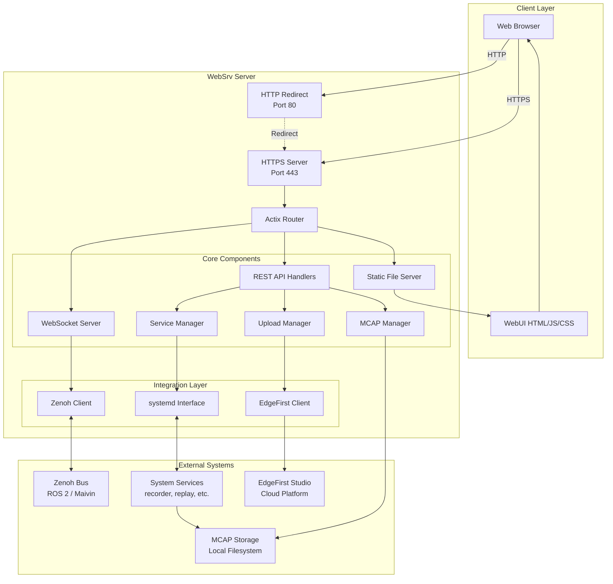

### Component Responsibilities

#### ServerContext
**Location**: `main.rs` - struct ServerContext

Central application context shared across all request handlers via Actix-web's `Data<T>` mechanism.

**Fields**:
- `args: Args` - Command-line configuration (docroot, storage path, Zenoh topics, mode)
- `err_stream: Arc<MessageStream>` - WebSocket broadcaster for error/dropped frame notifications
- `err_count: AtomicI64` - Thread-safe frame drop counter
- `upload_manager: Arc<UploadManager>` - Studio upload orchestration

#### MessageStream
**Location**: `main.rs` - struct MessageStream

Generic WebSocket broadcast infrastructure using the observer pattern.

**Responsibilities**:
- Maintain list of connected WebSocket clients (`Vec<Recipient<BroadcastMessage>>`)
- Broadcast binary messages to all subscribers
- Handle backpressure (high vs low priority modes)
- Execute cleanup callbacks on errors

**Usage Pattern**:
```
MessageStream::new(exit_tx, on_error_fn, is_high_priority)
  .add_client(ws_recipient)
  .broadcast(BroadcastMessage(bytes))
```

#### Upload Manager
**Location**: `main.rs` - struct UploadManager

Orchestrates background upload tasks to EdgeFirst Studio with persistent state tracking.

**Architecture**: See dedicated [Upload Manager Architecture](#upload-manager-architecture) section below.

## Communication Architecture

### WebSocket Subsystem

```mermaid
graph LR
    subgraph "Browser"
        WSClient1[WebSocket Client 1]
        WSClient2[WebSocket Client 2]
        WSClient3[WebSocket Client 3]
    end

    subgraph "WebSrv - WebSocket Handlers"
        WSError[/ws/dropped<br/>Error Stream]
        WSMask[/rt/detect/mask<br/>High Priority]
        WSGeneral[/rt/...*<br/>Low Priority]
        WSMCAP[/mcap/<br/>File Browser]
    end

    subgraph "Message Streams"
        ErrStream[Error MessageStream]
        VideoStream1[Video MessageStream<br/>Capacity: 16]
        VideoStream2[Data MessageStream<br/>Capacity: 1]
        MCAPStream[MCAP List Stream]
    end

    subgraph "Data Sources"
        ZenohThread1[Zenoh Listener Thread]
        ZenohThread2[Zenoh Listener Thread]
        FileScanner[Directory Scanner]
    end

    WSClient1 --> WSError
    WSClient2 --> WSMask
    WSClient3 --> WSGeneral

    WSError --> ErrStream
    WSMask --> VideoStream1
    WSGeneral --> VideoStream2
    WSMCAP --> MCAPStream

    VideoStream1 --> ZenohThread1
    VideoStream2 --> ZenohThread2
    MCAPStream --> FileScanner

    ErrStream -.-> |Frame drops| WSClient1
    VideoStream1 -.-> |Binary frames| WSClient2
    VideoStream2 -.-> |Binary frames| WSClient3
```

**WebSocket Handlers**:

| Endpoint | Priority | Capacity | Purpose | Handler Function |
|----------|----------|----------|---------|------------------|
| `/ws/dropped` | Normal | 1 | Error/dropped frame notifications | `websocket_handler_errors` |
| `/rt/detect/mask` | High | 16 | Segmentation mask stream | `websocket_handler_high_priority` |
| `/rt/{tail:.*}` | Low | 1 | General Zenoh topics | `websocket_handler_low_priority` |
| `/mcap/` | Normal | Default | MCAP file list updates | `mcap_websocket_handler` |

**Priority Modes**:
- **High Priority**: Uses `do_send()` (mailbox capacity 16) - never drops frames, may apply backpressure
- **Low Priority**: Uses `try_send()` (mailbox capacity 1) - drops frames on overflow, increments error counter

### Zenoh Integration

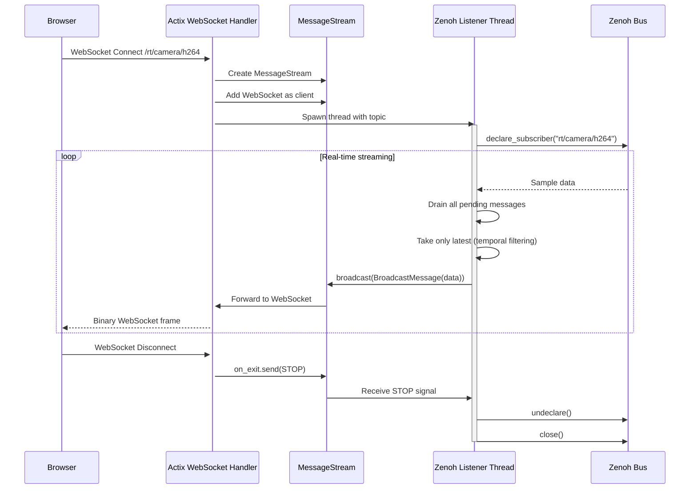

**Zenoh Configuration** (via `Args`):
- Mode: peer/client/router (default: peer)
- Connect endpoints: explicit Zenoh locators
- Listen endpoints: local bind addresses
- Multicast scouting: disabled by default for production
- Interface: loopback (lo) only

**Function**: `zenoh_listener(video_stream, args, rx, topic)`

## MCAP Management

### File Operations

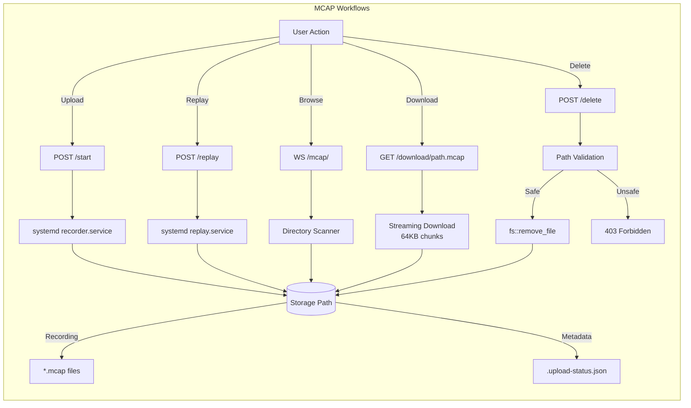

**MCAP File Structure Analysis**:

Function: `read_mcap_info(path)` → `(HashMap<String, TopicInfo>, f64)`

1. Memory-map MCAP file using `memmap::Mmap`
2. Read summary metadata via `mcap::Summary::read()`
3. Extract statistics:
   - Message start/end timestamps
   - Channel metadata (topics, schemas)
   - Message counts per channel
4. Calculate per-topic metrics:
   - Message count
   - Average FPS (messages/duration)
   - Video length (duration in seconds)

**MCAP Download Streaming**:

Function: `mcap_downloader(req)` → `HttpResponse`

- Validates `.mcap` extension (case-insensitive)
- Streams file asynchronously using `async_stream!` macro
- 64KB buffer chunks
- Content-Type: `application/octet-stream`
- Content-Length header for progress tracking

### Recording Control

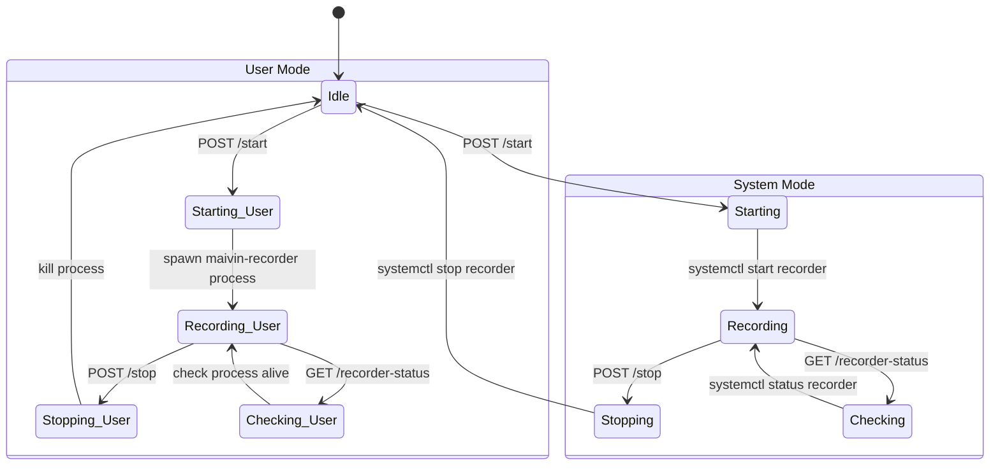

**System Mode**: `start()`, `stop()`, `check_recorder_status()`
- Uses `systemctl start/stop recorder.service`
- Reads config from `/etc/default/recorder`
- Environment variables: `CAMERA_TOPIC`, `STORAGE_DIR`, `TAG`

**User Mode**: `user_mode_start()`, `user_mode_stop()`, `user_mode_check_recorder_status()`
- Spawns `maivin-recorder` directly with `--storage`, `--tag` args
- Tracks process via `AppState.process: Mutex<Option<Child>>`
- Uses command-line arguments from WebUI

### MCAP Playback

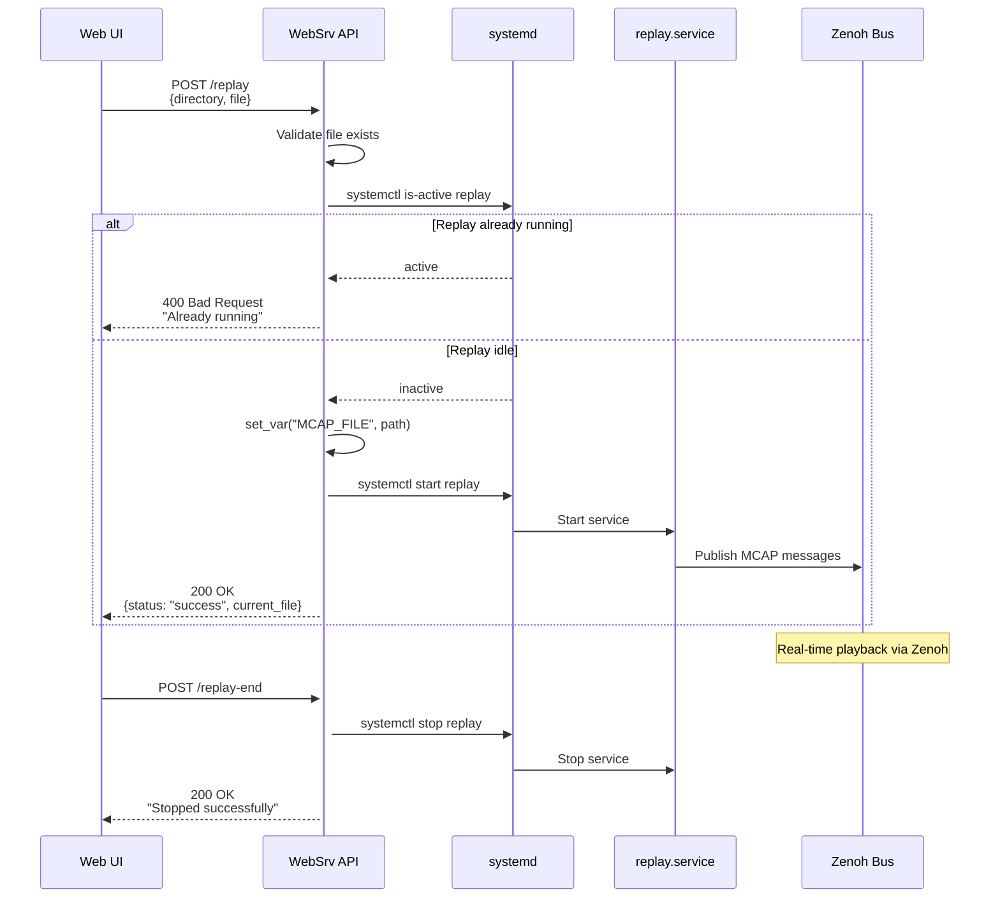

## Service Management

### systemd Integration (System Mode)

```mermaid
graph TB
    subgraph "Service Control API"
        GetStatus[POST /config/service/status<br/>get_all_services]
        UpdateSvc[POST /config/services/update<br/>update_service]
        GetConfig[GET /config/{service}/details<br/>get_config]
        SetConfig[POST /config/{service}<br/>set_config]
    end

    subgraph "systemd Commands"
        IsActive[systemctl is-active]
        IsEnabled[systemctl is-enabled]
        Start[systemctl start]
        Stop[systemctl stop]
        Enable[systemctl enable]
        Disable[systemctl disable]
    end

    subgraph "Configuration Files"
        DefaultFiles[/etc/default/{service}]
    end

    GetStatus --> IsActive
    GetStatus --> IsEnabled

    UpdateSvc --> Start
    UpdateSvc --> Stop
    UpdateSvc --> Enable
    UpdateSvc --> Disable

    GetConfig --> DefaultFiles
    SetConfig --> DefaultFiles
    SetConfig --> IsActive
```

**Supported Services**:
- `recorder.service` - MCAP recording
- `replay.service` - MCAP playback
- Custom Maivin services (camera, inference, fusion, etc.)

**Configuration Format** (`/etc/default/{service}`):
```bash
CAMERA_TOPIC=/rt/camera/h264
STORAGE_DIR=/var/lib/maivin/mcap
TAG=production
ENABLE_COMPRESSION=true
```

Parsed as key-value pairs, supports both single values and space-separated arrays.

### Service Lifecycle

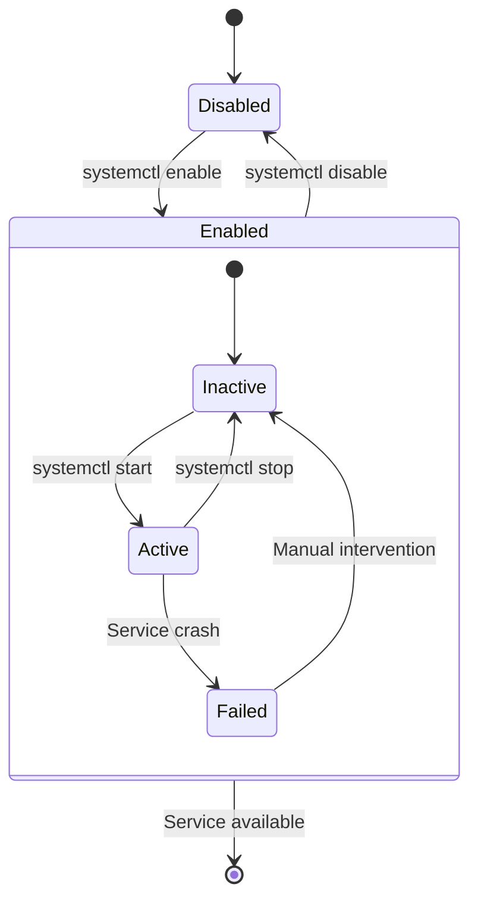

## Upload Manager Architecture

### Design Philosophy

- **Non-blocking uploads**: All upload operations run as background Tokio tasks
- **Persistent state**: Upload status persisted to `.upload-status.json` files for power loss recovery
- **Real-time feedback**: WebSocket broadcasting for live progress updates
- **User control**: Users can close browser and return later to check progress

### Core Components

**Data Structures** (defined in `main.rs`):

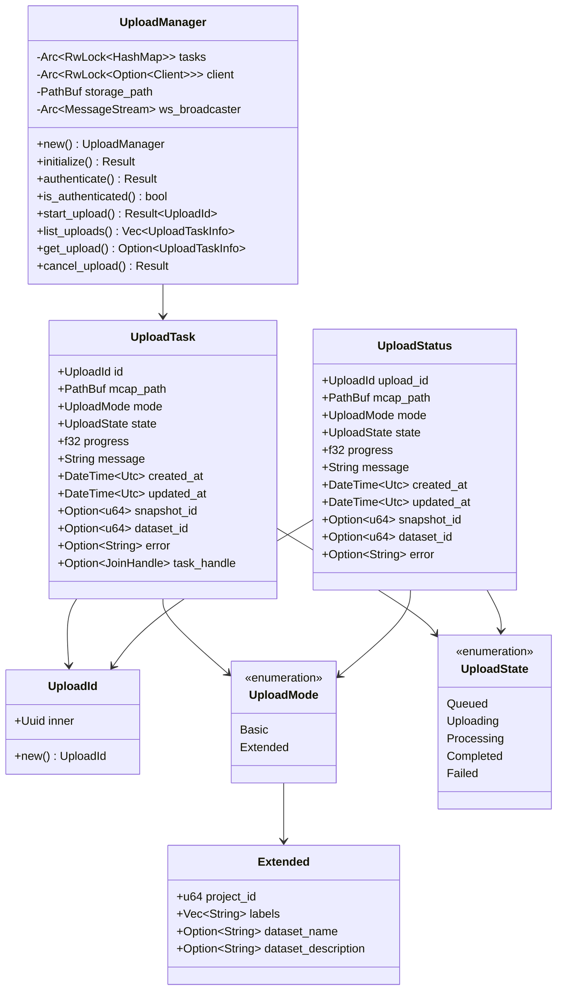

### Upload Workflow

**Basic Mode**:
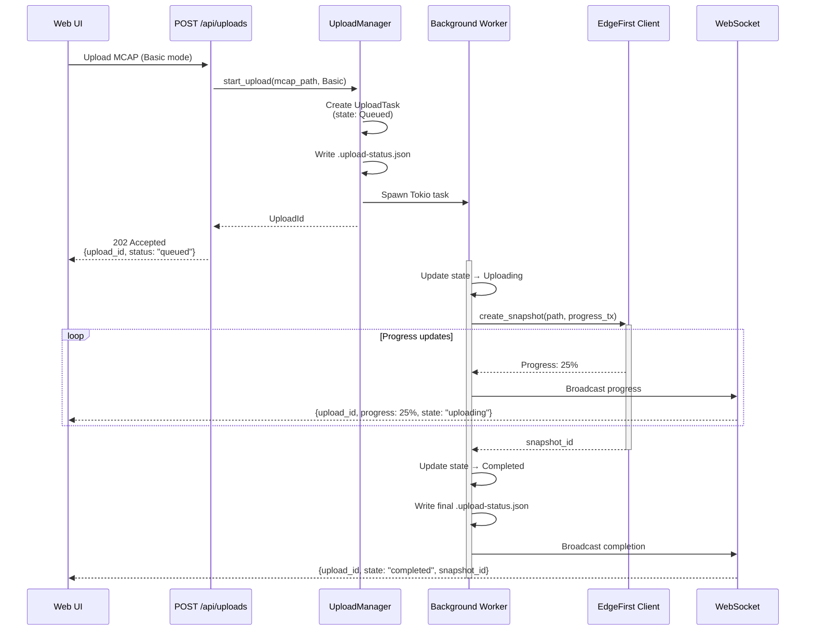

**Extended Mode (with Auto-labeling)**:
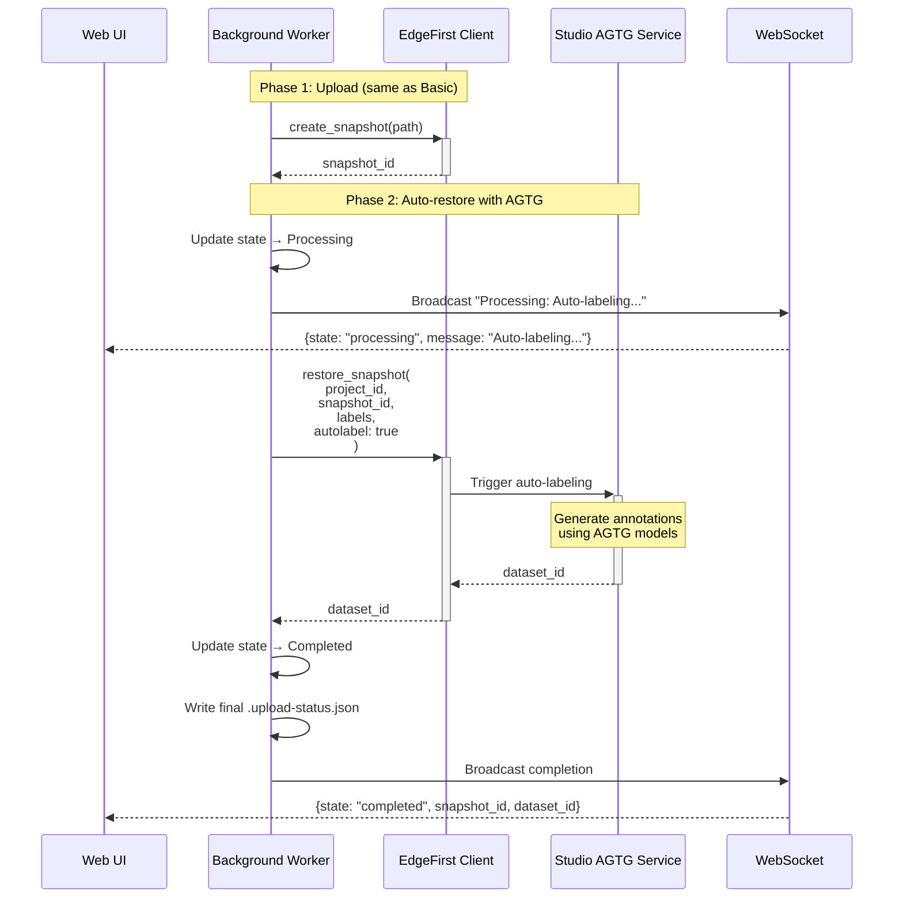

### Power Loss Recovery

**Initialization Flow**:

```mermaid
flowchart TD
    Start([WebSrv Startup]) --> Init[UploadManager::initialize]
    Init --> Scan[Scan storage_path for *.mcap files]
    Scan --> FindStatus{For each MCAP,<br/>find .upload-status.json}

    FindStatus --> |Found| LoadStatus[Load UploadStatus]
    FindStatus --> |Not found| Skip[Skip file]

    LoadStatus --> CheckState{state ==<br/>"completed"?}
    CheckState --> |Yes| Skip
    CheckState --> |No| MarkFailed[Update state → Failed<br/>error: "Power loss or<br/>server restart"]

    MarkFailed --> WriteStatus[Write updated<br/>.upload-status.json]
    WriteStatus --> AddRegistry[Add to in-memory<br/>task registry]

    AddRegistry --> FindStatus
    Skip --> FindStatus

    FindStatus --> |Done| Complete([Initialization Complete])

    Complete --> UserAPI[Users see failed uploads<br/>via GET /api/uploads]
```

### Authentication

EdgeFirst Studio authentication uses token-based auth via the `edgefirst-client` crate:

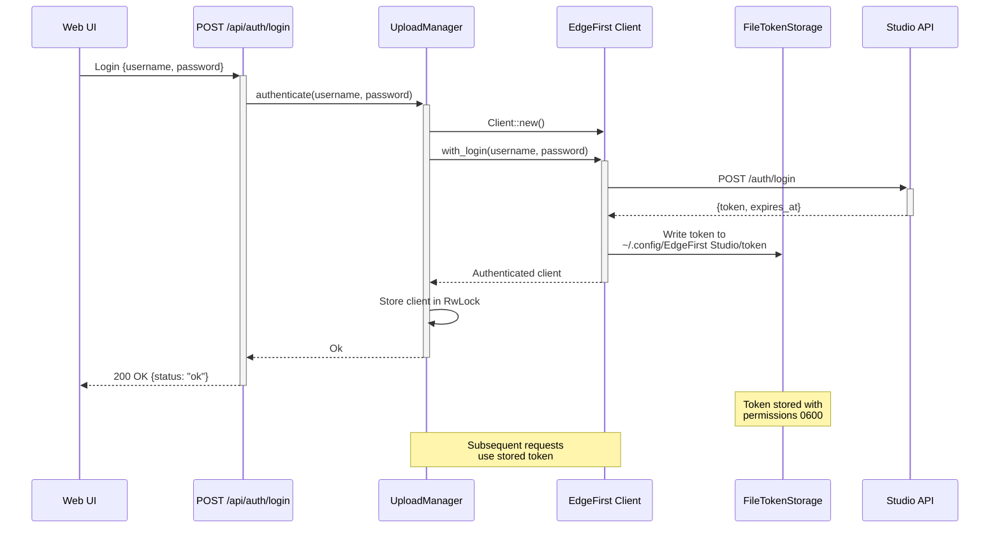

**Token Storage**:
- Default path: `~/.config/EdgeFirst Studio/token`
- File permissions: `0600` (owner read/write only)
- Automatic token refresh on expiration
- Single-user model (one Studio account per websrv instance)

### API Endpoints (Planned)

| Method | Endpoint | Handler | Purpose |
|--------|----------|---------|---------|
| POST | `/api/auth/login` | `auth_login` | Authenticate with Studio |
| GET | `/api/auth/status` | `auth_status` | Check authentication status |
| POST | `/api/uploads` | `start_upload` | Start new upload task |
| GET | `/api/uploads` | `list_uploads` | List all uploads (including completed/failed) |
| GET | `/api/uploads/{id}` | `get_upload` | Get specific upload details |
| DELETE | `/api/uploads/{id}` | `cancel_upload` | Cancel in-progress upload |
| WS | `/ws/uploads` | `upload_websocket_handler` | Real-time progress updates |

### State Transitions

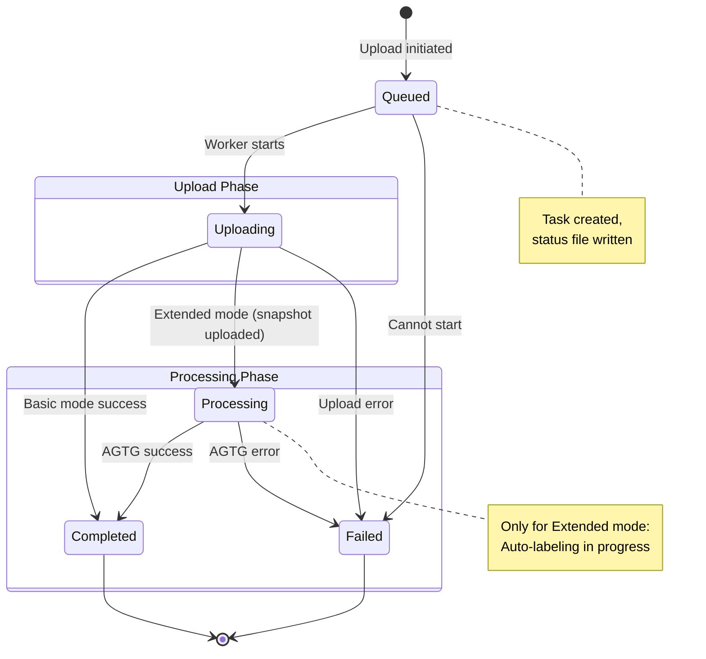

### Concurrency Model

- **Tokio async tasks** for background upload workers
- **Arc<RwLock<HashMap<UploadId, UploadTask>>>** for thread-safe task registry access
- **WebSocket broadcasting** via existing MessageStream infrastructure
- **Multiple concurrent uploads** supported (limited by system resources)

### Security Considerations

1. **Token Security**: FileTokenStorage uses restricted file permissions (0600)
2. **Path Validation**: MCAP paths validated to be within `storage_path`
3. **HTTPS Only**: All Studio communication over TLS
4. **No Credential Storage**: Username/password not persisted, only auth tokens
5. **Input Sanitization**: All API inputs validated before processing

### Integration with Existing Systems

- **MessageStream**: Reuses existing WebSocket broadcast infrastructure
- **ServerContext**: Upload manager added as `Arc<UploadManager>` field
- **Storage Path**: Uses same `args.storage_path` as MCAP recording
- **Actix-web**: All endpoints follow existing handler patterns
- **Error Handling**: Consistent with existing `anyhow::Result<>` patterns

## Configuration Management

### Configuration Files

```mermaid
graph TB
    subgraph "System Mode Config"
        direction TB
        DefaultFiles[/etc/default/*]
        RecorderConf[/etc/default/recorder]
        UploaderConf[/etc/default/uploader]
        CustomConf[/etc/default/{service}]
    end

    subgraph "User Mode Config"
        direction TB
        CmdLine[Command-line Args]
        WebUIArgs[WebUI Settings Page]
    end

    subgraph "WebSrv Args"
        direction TB
        Docroot[--docroot]
        StoragePath[--storage-path]
        System[--system]
        ZenohMode[--mode peer]
        Topics[Zenoh topic mappings]
    end

    GetConf[GET /config/{service}/details] --> DefaultFiles
    SetConf[POST /config/{service}] --> DefaultFiles

    WebUIArgs --> CmdLine

    DefaultFiles -.-> RecorderConf
    DefaultFiles -.-> UploaderConf
    DefaultFiles -.-> CustomConf

    CmdLine --> Docroot
    CmdLine --> StoragePath
    CmdLine --> System
    CmdLine --> ZenohMode
    CmdLine --> Topics
```

### Args Structure

**Location**: `args.rs` - struct Args

| Argument | Type | Default | Purpose |
|----------|------|---------|---------|
| `--docroot` | String | `/usr/share/webui` | Static file root directory |
| `--system` | bool | false | Enable system mode (vs user mode) |
| `--mode` | WhatAmI | peer | Zenoh connection mode |
| `--connect` | Vec<String> | [] | Zenoh endpoints to connect to |
| `--listen` | Vec<String> | [] | Zenoh endpoints to listen on |
| `--no-multicast-scouting` | bool | false | Disable Zenoh multicast |
| `--mask` | String | `/rt/model/mask_compressed` | Segmentation mask topic |
| `--detect` | String | `/rt/model/boxes2d` | Detection boxes topic |
| `--h264` | String | `/rt/camera/h264` | Video stream topic |
| `--draw-box` | bool | true | Enable bounding box overlay |
| `--draw-labels` | bool | true | Enable label overlay |
| `--mirror` | bool | true | Mirror video horizontally |
| `--storage-path` | String | `.` | MCAP storage directory |

## Security Architecture

### TLS/HTTPS Configuration

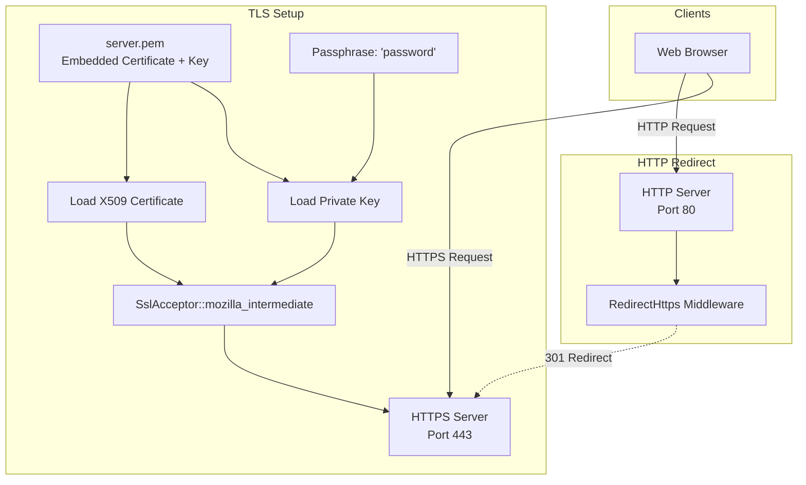

**TLS Implementation**:
- **Certificate**: Embedded in binary via `include_bytes!("../server.pem")`
- **Cipher Suites**: Mozilla Intermediate profile (OpenSSL)
- **Protocol**: TLS 1.2+ (via `SslMethod::tls()`)
- **Key Encryption**: Passphrase-protected private key
- **HTTP**: Always redirects to HTTPS via `RedirectHttps` middleware

### Path Validation

**MCAP Download** (`mcap_downloader`):
1. Extract filename from URL path parameter
2. Validate `.mcap` extension (case-insensitive)
3. Verify file exists and is a regular file
4. Reject if checks fail (403 Forbidden or 404 Not Found)

**File Deletion** (`delete`):
1. Construct full path from directory + filename
2. Validate path components (no directory traversal)
3. Verify file exists before deletion
4. Execute deletion only after all validations pass

**Configuration Access**:
- System mode: Restrict to `/etc/default/` directory
- User mode: Return in-memory WebUISettings (no filesystem access)

## Deployment Modes

### System Mode vs User Mode

```mermaid
graph TB
    subgraph "System Mode (--system)"
        direction TB
        SystemD_Mgmt[systemd Service Management]
        SystemD_Services[recorder.service<br/>replay.service<br/>Custom services]
        SystemConf[/etc/default/* configs]
        RootPerms[Requires sudo/root]

        SystemD_Mgmt --> SystemD_Services
        SystemD_Mgmt --> SystemConf
        SystemD_Services --> RootPerms
    end

    subgraph "User Mode (default)"
        direction TB
        Direct_Spawn[Direct Process Spawning]
        UserProcesses[maivin-recorder<br/>User-owned processes]
        CmdLineConf[Command-line arguments]
        UserPerms[Standard user permissions]

        Direct_Spawn --> UserProcesses
        Direct_Spawn --> CmdLineConf
        UserProcesses --> UserPerms
    end

    Args[Args::parse] --> |--system=true| SystemD_Mgmt
    Args --> |--system=false| Direct_Spawn
```

**System Mode** (`--system`):
- **Use Case**: Production deployments, system-wide services
- **Service Control**: Via `systemctl start/stop/enable/disable`
- **Configuration**: Files in `/etc/default/`
- **Recording**: `recorder.service` managed by systemd
- **Playback**: `replay.service` managed by systemd
- **Permissions**: Requires sudo for service operations
- **Routes**: Uses system-specific handlers (`start`, `stop`, `get_config`)

**User Mode** (default):
- **Use Case**: Development, single-user installations
- **Service Control**: Direct process spawning with `Command::new()`
- **Configuration**: Command-line arguments + WebUI settings
- **Recording**: `maivin-recorder` process in `AppState.process`
- **Playback**: `replay.service` (still uses systemd, may require user service)
- **Permissions**: Runs as current user
- **Routes**: Uses user-specific handlers (`user_mode_start`, `user_mode_stop`, `user_mode_get_config`)

**Handler Differences**:

| Function | System Mode | User Mode |
|----------|-------------|-----------|
| Start recording | `start()` → systemctl | `user_mode_start()` → spawn process |
| Stop recording | `stop()` → systemctl | `user_mode_stop()` → kill process |
| Check recorder | `check_recorder_status()` → systemctl | `user_mode_check_recorder_status()` → parse systemctl |
| Get config | `get_config()` → /etc/default | `user_mode_get_config()` → WebUISettings |
| Check replay | `check_replay_status()` → systemctl | `user_mode_check_replay_status()` → PID file |

## Data Flow Examples

### Real-Time Video Streaming

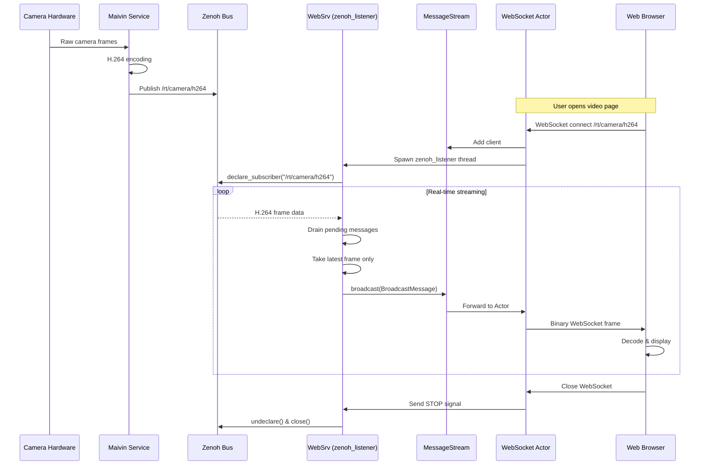

### MCAP Recording to Upload

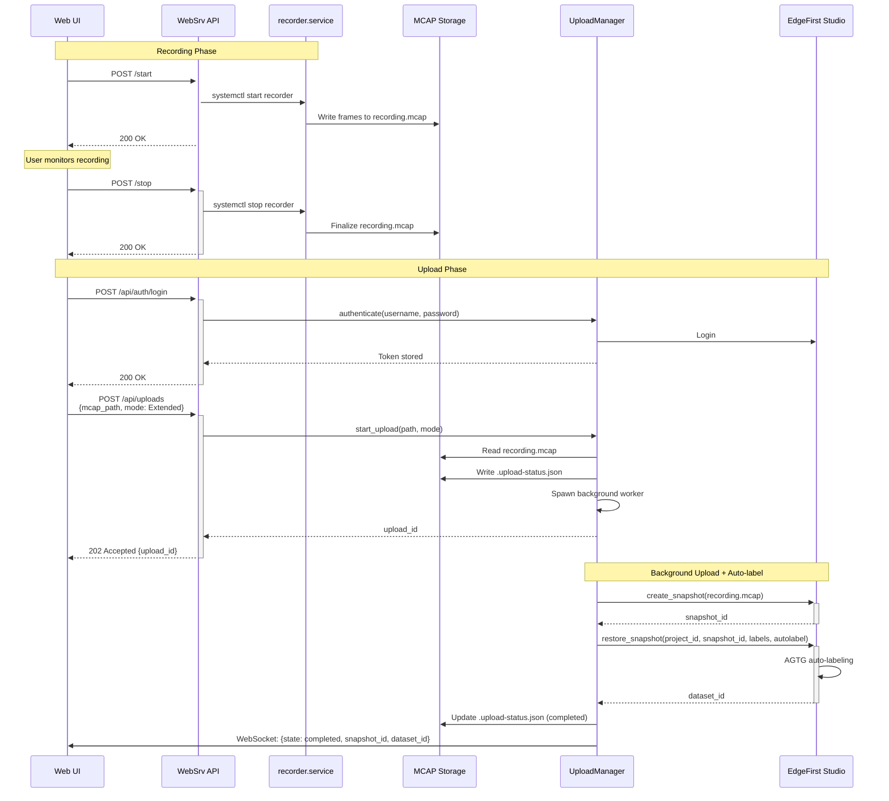

## Performance Considerations

### Optimization Strategies

**Static File Serving**:
- Actix-files middleware with efficient sendfile support
- Embedded certificate/key to avoid filesystem overhead
- Browser caching via HTTP cache headers

**WebSocket Efficiency**:
- Binary serialization (CDR format) for minimal overhead
- Mailbox capacity tuning (1 vs 16) based on priority
- Temporal filtering (latest-only) for high-frequency streams
- Backpressure handling via `try_send()` vs `do_send()`

**Concurrency**:
- 8-worker Tokio runtime (`worker_threads = 8`)
- Multi-threaded HTTP server (Actix-web default)
- Arc/Mutex/RwLock for minimal lock contention
- Separate threads for Zenoh listeners (blocking I/O isolation)

**MCAP Handling**:
- Memory-mapped file access for zero-copy reads
- Streaming downloads (64KB chunks) to avoid buffering
- Asynchronous file operations via `tokio::fs`

**Connection Pooling**:
- WebSocket connection reuse for persistent streams
- Zenoh session pooling (one session per subscriber thread)

### Resource Usage

**Memory**:
- WebSocket mailboxes: 1-16 messages × frame size
- MCAP memory maps: Shared read-only mapping (minimal overhead)
- Upload task registry: HashMap with task metadata only (not MCAP contents)

**Network**:
- HTTPS: TLS overhead (10-15% vs plain HTTP)
- WebSocket: Binary frames with minimal protocol overhead
- Zenoh: UDP-based with built-in compression

**Disk I/O**:
- Sequential writes during recording (optimal for SSDs and HDDs)
- Memory-mapped reads for MCAP analysis (kernel page cache)
- Asynchronous file operations to avoid blocking Tokio workers

## Future Enhancements

### Planned Features

1. **Multi-user Support**
   - Per-user authentication tokens
   - Role-based access control (RBAC)
   - User-specific upload queues

2. **Advanced Upload Management**
   - Automatic retry on network failures
   - Bandwidth throttling for background uploads
   - Upload queue prioritization

3. **Enhanced Monitoring**
   - System metrics dashboard (CPU, memory, disk I/O)
   - Real-time Zenoh topic monitoring
   - Upload progress aggregation (total bytes, ETA)

4. **Studio Integration Enhancements**
   - Batch snapshot uploads
   - Snapshot metadata editing
   - Direct dataset browsing from WebUI

5. **Configuration**
   - Web-based configuration editor
   - Configuration version control
   - Configuration import/export

6. **Custom Dashboards**
   - User-defined layouts
   - Widget library (charts, gauges, video players)
   - Saved dashboard templates

7. **Remote Deployment Management**
   - Fleet management for multiple devices
   - Remote configuration updates
   - Centralized logging and monitoring

### Technical Debt

- Replace embedded certificate with proper PKI
- Add API versioning (`/api/v1/...`)
- Implement structured logging (JSON format)
- Add comprehensive error type hierarchy (replace `anyhow`)
- Implement request tracing (distributed tracing support)
- Add unit and integration test coverage
- Performance benchmarking suite
- API documentation (OpenAPI/Swagger)

## References

### Key Source Files

| File | Primary Responsibilities |
|------|-------------------------|
| `src/main.rs` | HTTP server, WebSocket handlers, API endpoints, Upload Manager |
| `src/args.rs` | Command-line argument parsing, configuration conversion |

### External Dependencies

| Crate | Version | Purpose |
|-------|---------|---------|
| `actix-web` | 4.12.1 | HTTP server framework |
| `actix-web-actors` | 4.3.0 | WebSocket actor support |
| `zenoh` | 1.6.2 | Real-time data bus |
| `mcap` | 0.23.4 | MCAP file format parsing |
| `edgefirst-client` | 2.6.4 | EdgeFirst Studio API client |
| `tokio` | 1.48.0 | Async runtime |
| `openssl` | 0.10.75 | TLS/SSL support |
| `serde_json` | 1.0.140 | JSON serialization |
| `uuid` | 1.18.1 | Unique identifiers |
| `chrono` | 0.4.42 | Date/time handling |

### Related Documentation

- **Actix-web**: https://actix.rs/docs/
- **Zenoh**: https://zenoh.io/docs/
- **MCAP Format**: https://mcap.dev/
- **EdgeFirst Studio API**: Internal documentation
- **Tokio Runtime**: https://tokio.rs/tokio/tutorial

---

**Document Version**: 1.0
**Last Updated**: 2025-12-15
**Author**: Sébastien Taylor <sebastien@au-zone.com>
