# Maivin WebSrv Architecture

## Executive Summary

Maivin WebSrv is a high-performance web-based user interface server for monitoring and controlling the EdgeFirst Maivin platform. Built on axum with rustls-based TLS support, it provides a comprehensive web interface for managing MCAP recordings, controlling system services, monitoring real-time data streams via Zenoh, and uploading snapshots to EdgeFirst Studio.

**Key Technologies:**
- **Web Framework**: axum 0.8 with 8-worker Tokio runtime
- **Security**: HTTPS/TLS via rustls with flexible certificate management
- **Real-time Communication**: WebSocket (yawc with permessage-deflate) + Zenoh 1.6.2
- **Data Format**: MCAP (robotics recording format)
- **Concurrency**: Tokio async/await with Arc/Mutex synchronization
- **Service Management**: systemd integration (system mode) or process-based (user mode)
- **Deployment**: systemd socket activation support for non-root operation

## System Architecture

### High-Level Architecture

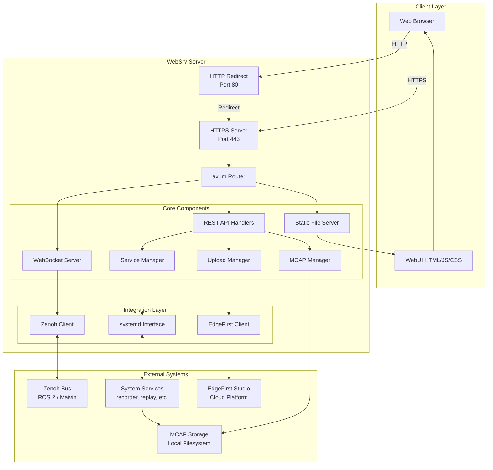
```mermaid
graph TB
    subgraph "Client Layer"
        Browser[Web Browser]
        WebUI[WebUI HTML/JS/CSS]
    end

    subgraph "WebSrv Server"
        HTTPS[HTTPS Server<br/>Port 443]
        HTTP[HTTP Redirect<br/>Port 80]
        Router[axum Router]

        subgraph "Core Components"
            StaticFiles[Static File Server]
            RestAPI[REST API Handlers]
            WSServer[WebSocket Server]
            UploadMgr[Upload Manager]
            SvcMgr[Service Manager]
            MCAPMgr[MCAP Manager]
        end

        subgraph "Integration Layer"
            ZenohClient[Zenoh Client]
            SystemD[systemd Interface]
            Studio[EdgeFirst Client]
        end
    end

    subgraph "External Systems"
        ZenohBus[Zenoh Bus<br/>ROS 2 / Maivin]
        Services[System Services<br/>recorder, replay, etc.]
        StudioCloud[EdgeFirst Studio<br/>Cloud Platform]
        Storage[MCAP Storage<br/>Local Filesystem]
    end

    Browser --> |HTTPS| HTTPS
    Browser --> |HTTP| HTTP
    HTTP -.-> |Redirect| HTTPS
    HTTPS --> Router
    WebUI --> Browser

    Router --> StaticFiles
    Router --> RestAPI
    Router --> WSServer

    RestAPI --> UploadMgr
    RestAPI --> SvcMgr
    RestAPI --> MCAPMgr

    WSServer --> ZenohClient
    ZenohClient <--> ZenohBus

    SvcMgr --> SystemD
    SystemD <--> Services

    UploadMgr --> Studio
    Studio --> StudioCloud

    MCAPMgr --> Storage
    Services --> Storage

    StaticFiles --> WebUI
```

### Component Responsibilities

#### ServerContext
**Location**: `main.rs` - struct ServerContext

Central application context shared across all request handlers via axum's `State<Arc<T>>` mechanism.

**Fields**:
- `args: Args` - Command-line configuration (docroot, storage path, Zenoh topics, mode)
- `err_stream: Arc<MessageStream>` - WebSocket broadcaster for error/dropped frame notifications
- `err_count: AtomicI64` - Thread-safe frame drop counter
- `upload_manager: Arc<UploadManager>` - Studio upload orchestration

#### MessageStream
**Location**: `main.rs` - struct MessageStream

Generic WebSocket broadcast infrastructure using the observer pattern.

**Responsibilities**:
- Maintain list of connected WebSocket clients (`Vec<Recipient<BroadcastMessage>>`)
- Broadcast binary messages to all subscribers
- Handle backpressure (high vs low priority modes)
- Execute cleanup callbacks on errors

**Usage Pattern**:
```
MessageStream::new(exit_tx, on_error_fn, is_high_priority)
  .add_client(ws_recipient)
  .broadcast(BroadcastMessage(bytes))
```

#### Upload Manager
**Location**: `main.rs` - struct UploadManager

Orchestrates background upload tasks to EdgeFirst Studio with persistent state tracking.

**Architecture**: See dedicated [Upload Manager Architecture](#upload-manager-architecture) section below.

## Communication Architecture

### WebSocket Subsystem

```mermaid
graph LR
    subgraph "Browser"
        WSClient1[WebSocket Client 1]
        WSClient2[WebSocket Client 2]
        WSClient3[WebSocket Client 3]
    end

    subgraph "WebSrv - WebSocket Handlers"
        WSError[/ws/dropped<br/>Error Stream]
        WSMask[/api/rt/model/output<br/>High Priority]
        WSGeneral[/api/rt/...*<br/>Low Priority]
        WSMCAP[/mcap/<br/>File Browser]
    end

    subgraph "Message Streams"
        ErrStream[Error MessageStream]
        VideoStream1[Video MessageStream<br/>Capacity: 16]
        VideoStream2[Data MessageStream<br/>Capacity: 1]
        MCAPStream[MCAP List Stream]
    end

    subgraph "Data Sources"
        ZenohThread1[Zenoh Listener Thread]
        ZenohThread2[Zenoh Listener Thread]
        FileScanner[Directory Scanner]
    end

    WSClient1 --> WSError
    WSClient2 --> WSMask
    WSClient3 --> WSGeneral

    WSError --> ErrStream
    WSMask --> VideoStream1
    WSGeneral --> VideoStream2
    WSMCAP --> MCAPStream

    VideoStream1 --> ZenohThread1
    VideoStream2 --> ZenohThread2
    MCAPStream --> FileScanner

    ErrStream -.-> |Frame drops| WSClient1
    VideoStream1 -.-> |Binary frames| WSClient2
    VideoStream2 -.-> |Binary frames| WSClient3
```

**WebSocket Handlers**:

| Endpoint | Priority | Capacity | Purpose | Handler Function |
|----------|----------|----------|---------|------------------|
| `/ws/dropped` | Normal | 1 | Error/dropped frame notifications | `websocket_handler_errors` |
| `/api/rt/{*topic}` | High / Low | 16 / 1 | Zenoh topics (H.264, model, sensors) | `websocket_handler` |
| `/mcap/` | Normal | Default | MCAP file list updates | `mcap_websocket_handler` |

**Priority Modes**:
- **High Priority**: Uses `do_send()` (mailbox capacity 16) - never drops frames, may apply backpressure
- **Low Priority**: Uses `try_send()` (mailbox capacity 1) - drops frames on overflow, increments error counter

### Zenoh Integration

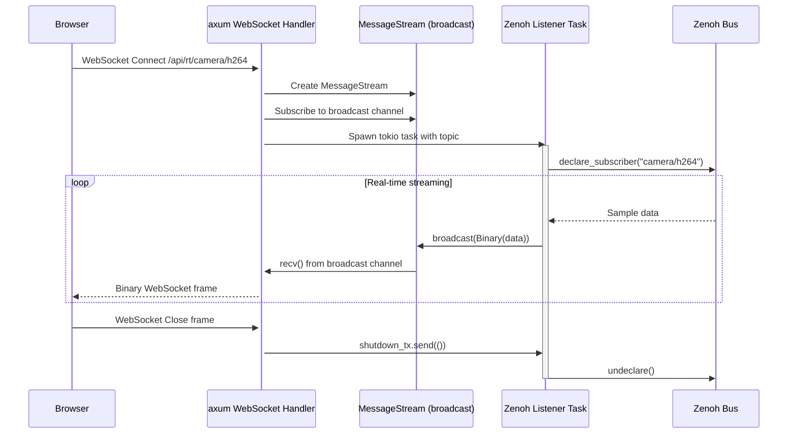
```mermaid
sequenceDiagram
    participant Browser
    participant AxumWS as axum WebSocket Handler
    participant Stream as MessageStream (broadcast)
    participant Zenoh as Zenoh Listener Task
    participant ZenohBus as Zenoh Bus

    Browser->>+AxumWS: WebSocket Connect /api/rt/camera/h264
    AxumWS->>Stream: Create MessageStream
    AxumWS->>Stream: Subscribe to broadcast channel
    AxumWS->>Zenoh: Spawn tokio task with topic

    activate Zenoh
    Zenoh->>ZenohBus: declare_subscriber("camera/h264")

    loop Real-time streaming
        ZenohBus-->>Zenoh: Sample data
        Zenoh->>Stream: broadcast(Binary(data))
        Stream->>AxumWS: recv() from broadcast channel
        AxumWS-->>Browser: Binary WebSocket frame
    end

    Browser->>AxumWS: WebSocket Close frame
    AxumWS->>Zenoh: shutdown_tx.send(())
    Zenoh->>ZenohBus: undeclare()
    deactivate Zenoh
```

**Zenoh Configuration** (via `Args`):
- Mode: peer/client/router (default: peer)
- Connect endpoints: explicit Zenoh locators
- Listen endpoints: local bind addresses
- Multicast scouting: disabled by default for production
- Interface: loopback (lo) only

**Function**: `zenoh_listener(video_stream, args, rx, topic)`

## MCAP Management

### File Operations

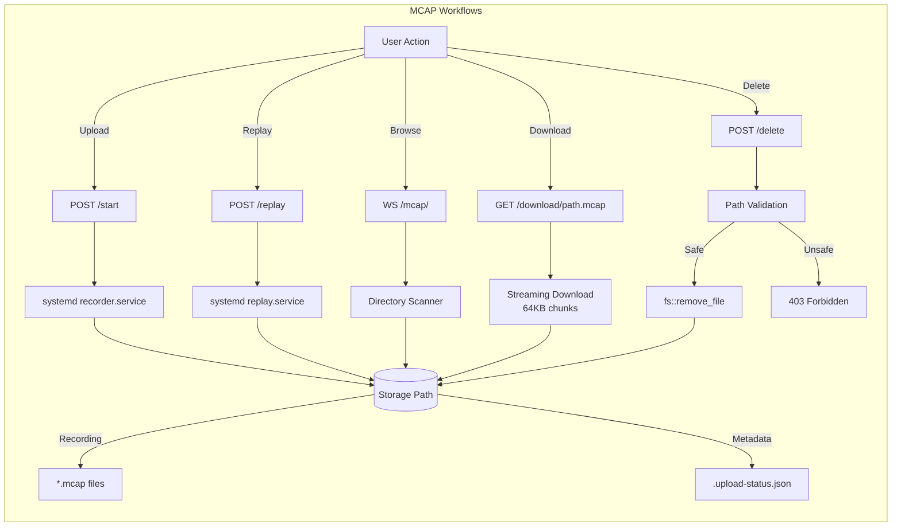
```mermaid
graph TB
    subgraph "MCAP Workflows"
        direction TB

        Start[User Action]

        Start --> |Upload| Upload[POST /start]
        Start --> |Download| Download[GET /download/path.mcap]
        Start --> |Delete| Delete[POST /delete]
        Start --> |Replay| Replay[POST /replay]
        Start --> |Browse| Browse[WS /mcap/]

        Upload --> Recorder[systemd recorder.service]
        Download --> Stream[Streaming Download<br/>64KB chunks]
        Delete --> ValidatePath[Path Validation]
        Replay --> ReplayService[systemd replay.service]
        Browse --> Scanner[Directory Scanner]

        ValidatePath --> |Safe| RemoveFile[fs::remove_file]
        ValidatePath --> |Unsafe| Reject[403 Forbidden]

        Recorder --> Storage[(Storage Path)]
        ReplayService --> Storage
        Scanner --> Storage
        Stream --> Storage
        RemoveFile --> Storage

        Storage --> |Recording| MCAPFile[*.mcap files]
        Storage --> |Metadata| StatusFile[.upload-status.json]
    end
```

**MCAP File Structure Analysis**:

Function: `read_mcap_info(path)` → `McapInfo` (`topics: HashMap<String, TopicInfo>`, `duration_s`, `clock_steps`); timeline reconstruction lives in `src/mcap_timeline.rs`

1. Memory-map the MCAP file using `memmap::Mmap`
2. Summary path, taken when `Summary::read()` succeeds and carries statistics and chunk indexes, and metadata indexes whenever the statistics count Metadata records:
   - Collect `clock_step` Metadata records from the metadata indexes, ordered by file offset (`step_ns` is a signed decimal-integer string), and note whether a `clock_sync` record is present
   - Walk the chunk indexes in file order (not time order) and feed each chunk's `log_time` span to `TimelineAccumulator`
   - Files from recorders that write a `clock_sync` Metadata record (written when the file is opened) take clock steps only from their `clock_step` records. A segment ends at each `clock_step` Metadata offset. An unrecorded forward jump in `log_time` larger than 5 s (`STEP_GAP_NS`) is a pause in the data: it is held as tentative until the data after it either returns as a stray excursion (below) or spans more than 5 s, and a pause joins the segments on either side, so its time counts toward the duration and toward each topic's span. An unrecorded backward jump larger than 5 s cannot be a pause, so it still splits the timeline, but it is not counted as a clock step
   - Older files without `clock_sync` fall back to gap detection: a segment also ends at any jump in `log_time` larger than 5 s, in either direction, and each such jump counts as a clock step
   - A record that arrives within 5 s of data after a gap-detected jump describes that jump, and is not counted twice, when its `step_ns` is within 5 s of the jump, or when it is in the same direction as the jump and the jump goes further forward than the step: the step happened during a pause in the data, and with `clock_sync` that pause (jump − `step_ns`) counts as an ordinary pause does: the segments on either side are joined, the earlier one moved by `step_ns` into the later one's clock, so the pause counts toward the duration and toward each topic's span, and a topic present on both sides spans both and the pause as one segment (without `clock_sync` the whole jump is excluded, as for any gap). A record that does not describe the pending jump, such as a step in the opposite direction or one larger than the jump, is a step of its own: the pending jump is settled as it would be without a record (with `clock_sync`, a pause still counts toward the duration) and the record closes the segment
   - The recording duration is the sum of the segment durations, each the merged extent of its spans
   - The writer may put messages taken after a step into the chunk written before the step's record. The entry immediately before each `clock_step` record (that chunk, or the run of decompressed or unchunked messages) is therefore resolved to its messages in file order, from its MessageIndex records sorted by message offset without decompressing the chunk. There is a leak only when the data after the record continues the time base of that entry's last message `e`: with `n` the first `log_time` after the record, `|n − e| < |n − e − step_ns|`. When no data follows the record, only the pairs decide. The split is the consecutive pair whose `log_time` difference best matches `step_ns`: within 5 s of it, in the same direction, and closer to it than to no change (ties go to the later pair). The end of the data fed before that entry also takes part in the pairs, as a reference point only (it is not fed again), so a leak that starts at the entry's first message, or a chunk made only of post-step messages, splits before the whole entry. Only pairs ending in the trailing run of messages within 5 s of `e` are considered, because a leak is no older than the record's write latency; this also bounds the search in a long run of unchunked messages. Messages before the split end the closing segment, and those after it open the next one, for the duration and for every topic's span. When no pair qualifies, there is no leak, so an ordinary dropout before a record is not mistaken for the step. Only that one entry is examined per record, so the cost stays bounded. If the chunk's message indexes are missing or unparseable, its span is used instead: when it is at least as long as the step, its end is moved back by the step's size (assuming the post-step data closes the chunk), and the segment's duration is still its merged extent
   - A chunk spanning more than 5 s is resolved message by message from its MessageIndex records, without decompressing the chunk, so a step inside a chunk is still found
   - A short excursion found by gap detection alone (at most 5 s of data) that returns to within 5 s of the timeline it left, such as a stray message written around a clock step, is not counted as a step and adds no duration; the preceding segment is re-opened and continues, and the excursion's segment is abandoned: its messages still count in `message_count`, but they add no segment and no span to their topics. This applies with or without `clock_sync`. `clock_step` Metadata records always close a segment
3. Linear scan, used when the summary is missing or unreadable (power loss, crash), and for complete files whose summary has no statistics, or whose summary has statistics but no chunk indexes (the global statistics span cannot be split at the steps) or counts Metadata records without indexing them (the `clock_step` and `clock_sync` records can only be found in the data section). Files without Metadata records never take this path for that reason:
   - Walk the top-level records of the data section without decompressing chunk bodies: each Chunk header gives the chunk's `log_time` range and the MessageIndex records that follow it give per-channel message counts and times, so each chunk is fed to the timeline exactly as on the summary path; messages written outside chunks are fed one by one; `clock_step` Metadata records are taken in file order. The scan stops at DataEnd or Footer when the file is complete; for a complete file the summary's channels are then added, so topics without messages are still listed, and message counts are taken from its statistics where present. `MessageStream` is not used because it skips Metadata records
   - A chunk is decompressed only when its message indexes name a channel whose Channel record has not been seen yet (writers place Channel records inside chunks; when the record is not in that chunk, earlier undecompressed chunks are searched newest first), or when it has no message indexes; the last chunk before a truncated tail is always decompressed because its indexes may be incomplete. Messages of a decompressed chunk are counted and fed one by one
   - Cost: the scan touches the chunk headers, message indexes and Metadata records, plus the bodies of the chunks it decompresses (those introducing unseen channels, typically the first; those without message indexes; and the last chunk before a truncated tail) — for a recorder file, well under 1% of the file. The bodies of all other chunks are not paged in
   - A truncated tail ends the scan and everything read before it is kept
   - A file without a readable summary modified within the last 10 s (`IN_PROGRESS_WINDOW`) is assumed to still be recording and returns an empty `McapInfo`; a modification time in the future counts as finished. Any file with a readable summary, with or without statistics, is complete and is never held back
   - Results are cached per `(path, len, mtime)`, so an unchanged file is scanned once
   - `read_mcap_info` scans synchronously. The recordings listing uses `read_mcap_info_for_listing`, which never waits for a scan: on a cache miss it queues the file on a single background thread (started on first use) and reports it with `scanning: true` and empty topics; a file is queued at most once while queued or being scanned, and is released when its scan finishes, fails or panics. The cache is re-checked while holding the in-flight set before queuing, and a finished scan is cached before it leaves the set, so a scan completing concurrently is not queued again; the worker also skips a file whose unchanged scan was cached (for example by `read_mcap_info`) while it was queued. Both readers share the same scan and caching rules: a file that cannot be opened or mapped is not cached (`read_mcap_info` returns the error and the listing reports the file empty), and a scan that panics yields an empty result that is cached until the file changes
4. Exclude the `/clock_step` timeline-marker channel from the topic list and from all metrics
5. Calculate per-topic metrics:
   - `message_count` from the statistics (or the scan)
   - `video_length`: the topic's own span, the sum over timeline segments of the interval between the channel's first and last message `log_time` in that segment. These times are read from the MessageIndex records of the first and last chunk containing the channel in the segment (an empty index counts as absent); when an index is missing or cannot be parsed, the extent of the containing chunks' `log_time` spans is used instead. Chunks spanning more than 5 s, decompressed chunks and messages outside chunks are resolved to per-message times. Topics without a recorded span use the recording duration
   - `average_fps`: `(message_count - k) / video_length`, where `k` is the number of timeline segments holding the topic's messages (each segment's first message opens no interval), or 0 when there is no interval or no span; topics without a recorded span use `k = 1`
6. `/api/recordings` reports `average_video_length` as the whole-recording duration with clock steps removed, `clock_steps` as the number of steps excluded from it, and `scanning` (always present) as `true` while the file's background scan is pending; clients re-request the listing to get the result

**MCAP Download Streaming**:

Function: `mcap_downloader(req)` → `HttpResponse`

- Validates `.mcap` extension (case-insensitive)
- Streams file asynchronously using `async_stream!` macro
- 64KB buffer chunks
- Content-Type: `application/octet-stream`
- Content-Length header for progress tracking

### Recording Control

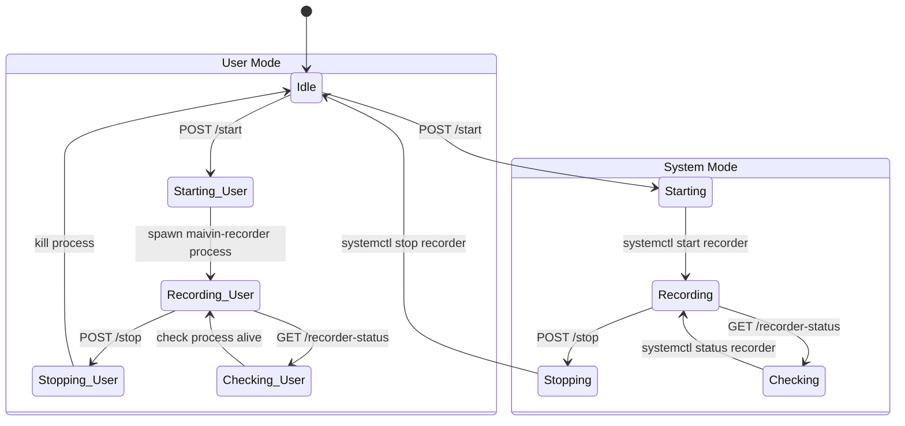
```mermaid
stateDiagram-v2
    [*] --> Idle

    state "System Mode" as SystemMode {
        Idle --> Starting: POST /start
        Starting --> Recording: systemctl start recorder
        Recording --> Stopping: POST /stop
        Stopping --> Idle: systemctl stop recorder

        Recording --> Checking: GET /recorder-status
        Checking --> Recording: systemctl status recorder
    }

    state "User Mode" as UserMode {
        Idle --> Starting_User: POST /start
        Starting_User --> Recording_User: spawn maivin-recorder process
        Recording_User --> Stopping_User: POST /stop
        Stopping_User --> Idle: kill process

        Recording_User --> Checking_User: GET /recorder-status
        Checking_User --> Recording_User: check process alive
    }
```

**System Mode**: `start()`, `stop()`, `check_recorder_status()`
- Uses `systemctl start/stop recorder.service`
- Reads config from `/etc/default/recorder`
- Environment variables: `CAMERA_TOPIC`, `STORAGE_DIR`, `TAG`

**User Mode**: `user_mode_start()`, `user_mode_stop()`, `user_mode_check_recorder_status()`
- Spawns `maivin-recorder` directly with `--storage`, `--tag` args
- Tracks process via `AppState.process: Mutex<Option<Child>>`
- Uses command-line arguments from WebUI

### MCAP Playback

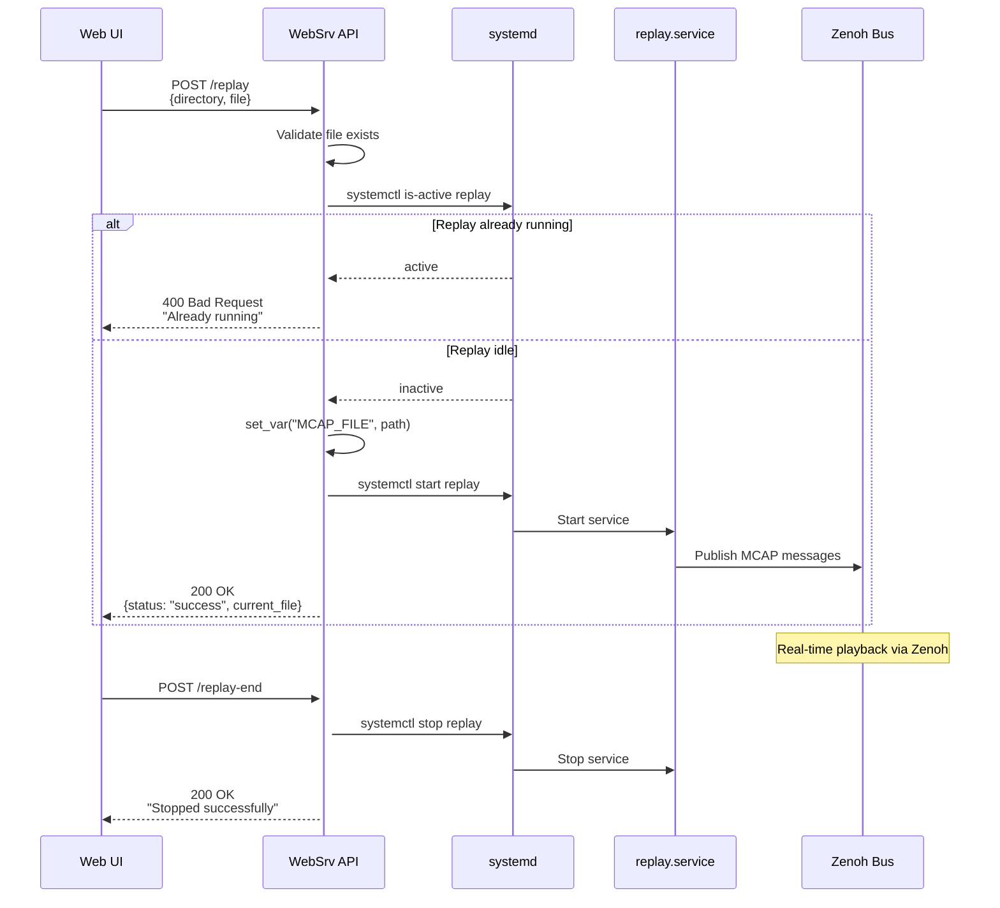
```mermaid
sequenceDiagram
    participant UI as Web UI
    participant API as WebSrv API
    participant SystemD as systemd
    participant Replay as replay.service
    participant Zenoh as Zenoh Bus

    UI->>+API: POST /replay<br/>{directory, file}
    API->>API: Validate file exists
    API->>SystemD: systemctl is-active replay

    alt Replay already running
        SystemD-->>API: active
        API-->>UI: 400 Bad Request<br/>"Already running"
    else Replay idle
        SystemD-->>API: inactive
        API->>API: set_var("MCAP_FILE", path)
        API->>SystemD: systemctl start replay
        SystemD->>Replay: Start service
        Replay->>Zenoh: Publish MCAP messages
        API-->>UI: 200 OK<br/>{status: "success", current_file}
    end

    Note over Zenoh: Real-time playback via Zenoh

    UI->>+API: POST /replay-end
    API->>SystemD: systemctl stop replay
    SystemD->>Replay: Stop service
    API-->>UI: 200 OK<br/>"Stopped successfully"
```

## Service Management

### systemd Integration (System Mode)

```mermaid
graph TB
    subgraph "Service Control API"
        GetStatus[POST /api/services/status<br/>get_all_services]
        UpdateSvc[POST /api/services/update<br/>update_service]
        GetConfig[GET /api/config/{service}<br/>get_config]
        SetConfig[POST /api/config/{service}<br/>set_config]
    end

    subgraph "systemd Commands"
        IsActive[systemctl is-active]
        IsEnabled[systemctl is-enabled]
        Start[systemctl start]
        Stop[systemctl stop]
        Enable[systemctl enable]
        Disable[systemctl disable]
    end

    subgraph "Configuration Files"
        DefaultFiles[/etc/default/{service}]
    end

    GetStatus --> IsActive
    GetStatus --> IsEnabled

    UpdateSvc --> Start
    UpdateSvc --> Stop
    UpdateSvc --> Enable
    UpdateSvc --> Disable

    GetConfig --> DefaultFiles
    SetConfig --> DefaultFiles
    SetConfig --> IsActive
```

**Supported Services**:
- `recorder.service` - MCAP recording
- `replay.service` - MCAP playback
- Custom Maivin services (camera, inference, fusion, etc.)

**Configuration Format** (`/etc/default/{service}`):
```bash
CAMERA_TOPIC=camera/h264
STORAGE_DIR=/var/lib/maivin/mcap
TAG=production
ENABLE_COMPRESSION=true
```

Parsed as key-value pairs, supports both single values and space-separated arrays.

### Service Lifecycle

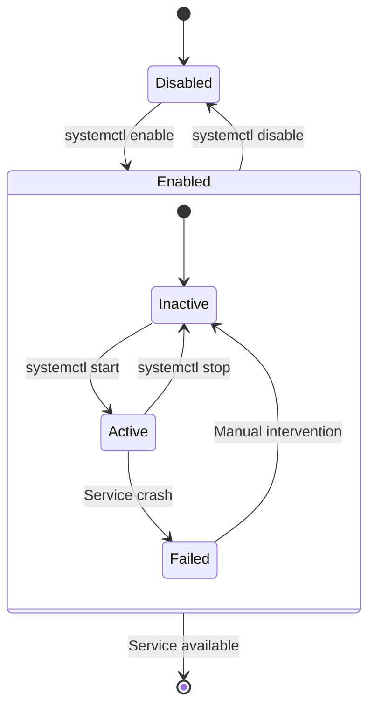
```mermaid
stateDiagram-v2
    [*] --> Disabled

    Disabled --> Enabled: systemctl enable
    Enabled --> Disabled: systemctl disable

    state Enabled {
        [*] --> Inactive
        Inactive --> Active: systemctl start
        Active --> Inactive: systemctl stop

        Active --> Failed: Service crash
        Failed --> Inactive: Manual intervention
    }

    Enabled --> [*]: Service available
```

## Upload Manager Architecture

### Design Philosophy

- **Non-blocking uploads**: All upload operations run as background Tokio tasks
- **Persistent state**: Upload status persisted to `.upload-status.json` files for power loss recovery
- **Real-time feedback**: WebSocket broadcasting for live progress updates
- **User control**: Users can close browser and return later to check progress

### Core Components

**Data Structures** (defined in `main.rs`):

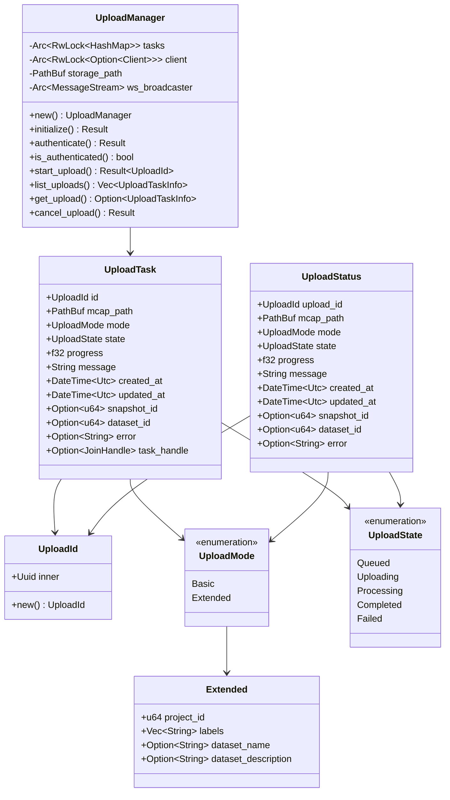
```mermaid
classDiagram
    class UploadId {
        +Uuid inner
        +new() UploadId
    }

    class UploadMode {
        <<enumeration>>
        Basic
        Extended
    }

    class Extended {
        +u64 project_id
        +Vec~String~ labels
        +Option~String~ dataset_name
        +Option~String~ dataset_description
    }

    class UploadState {
        <<enumeration>>
        Queued
        Uploading
        Processing
        Completed
        Failed
    }

    class UploadTask {
        +UploadId id
        +PathBuf mcap_path
        +UploadMode mode
        +UploadState state
        +f32 progress
        +String message
        +DateTime~Utc~ created_at
        +DateTime~Utc~ updated_at
        +Option~u64~ snapshot_id
        +Option~u64~ dataset_id
        +Option~String~ error
        +Option~JoinHandle~ task_handle
    }

    class UploadStatus {
        +UploadId upload_id
        +PathBuf mcap_path
        +UploadMode mode
        +UploadState state
        +f32 progress
        +String message
        +DateTime~Utc~ created_at
        +DateTime~Utc~ updated_at
        +Option~u64~ snapshot_id
        +Option~u64~ dataset_id
        +Option~String~ error
    }

    class UploadManager {
        -Arc~RwLock~HashMap~~ tasks
        -Arc~RwLock~Option~Client~~~ client
        -PathBuf storage_path
        -Arc~MessageStream~ ws_broadcaster
        +new() UploadManager
        +initialize() Result
        +authenticate() Result
        +is_authenticated() bool
        +start_upload() Result~UploadId~
        +list_uploads() Vec~UploadTaskInfo~
        +get_upload() Option~UploadTaskInfo~
        +cancel_upload() Result
    }

    UploadMode --> Extended
    UploadTask --> UploadId
    UploadTask --> UploadMode
    UploadTask --> UploadState
    UploadStatus --> UploadId
    UploadStatus --> UploadMode
    UploadStatus --> UploadState
    UploadManager --> UploadTask
```

### Upload Workflow

**Basic Mode**:
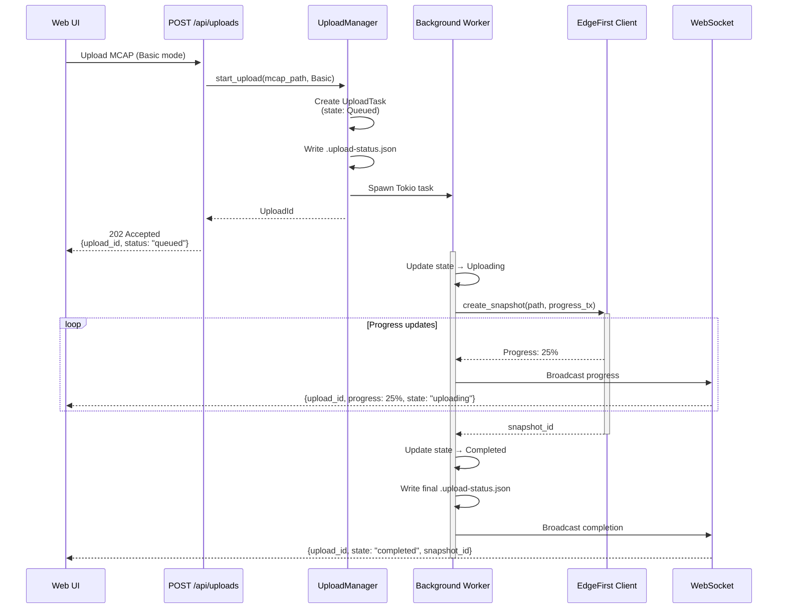
```mermaid
sequenceDiagram
    participant UI as Web UI
    participant API as POST /api/uploads
    participant UMgr as UploadManager
    participant Worker as Background Worker
    participant Studio as EdgeFirst Client
    participant WS as WebSocket

    UI->>+API: Upload MCAP (Basic mode)
    API->>+UMgr: start_upload(mcap_path, Basic)
    UMgr->>UMgr: Create UploadTask<br/>(state: Queued)
    UMgr->>UMgr: Write .upload-status.json
    UMgr->>Worker: Spawn Tokio task
    UMgr-->>API: UploadId
    API-->>UI: 202 Accepted<br/>{upload_id, status: "queued"}

    activate Worker
    Worker->>Worker: Update state → Uploading
    Worker->>+Studio: create_snapshot(path, progress_tx)

    loop Progress updates
        Studio-->>Worker: Progress: 25%
        Worker->>WS: Broadcast progress
        WS-->>UI: {upload_id, progress: 25%, state: "uploading"}
    end

    Studio-->>Worker: snapshot_id
    deactivate Studio
    Worker->>Worker: Update state → Completed
    Worker->>Worker: Write final .upload-status.json
    Worker->>WS: Broadcast completion
    WS-->>UI: {upload_id, state: "completed", snapshot_id}
    deactivate Worker
```

**Extended Mode (with Auto-labeling)**:
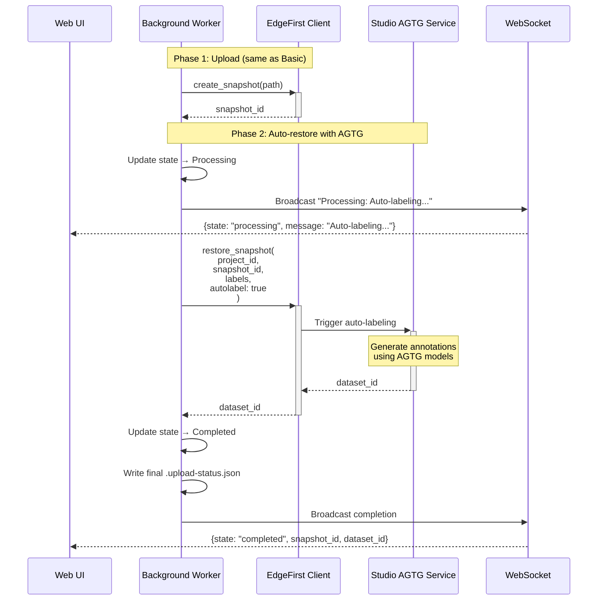
```mermaid
sequenceDiagram
    participant UI as Web UI
    participant Worker as Background Worker
    participant Studio as EdgeFirst Client
    participant AGTG as Studio AGTG Service
    participant WS as WebSocket

    Note over Worker,Studio: Phase 1: Upload (same as Basic)

    Worker->>+Studio: create_snapshot(path)
    Studio-->>Worker: snapshot_id
    deactivate Studio

    Note over Worker,AGTG: Phase 2: Auto-restore with AGTG

    Worker->>Worker: Update state → Processing
    Worker->>WS: Broadcast "Processing: Auto-labeling..."
    WS-->>UI: {state: "processing", message: "Auto-labeling..."}

    Worker->>+Studio: restore_snapshot(<br/>  project_id,<br/>  snapshot_id,<br/>  labels,<br/>  autolabel: true<br/>)
    Studio->>+AGTG: Trigger auto-labeling

    Note over AGTG: Generate annotations<br/>using AGTG models

    AGTG-->>Studio: dataset_id
    deactivate AGTG
    Studio-->>Worker: dataset_id
    deactivate Studio

    Worker->>Worker: Update state → Completed
    Worker->>Worker: Write final .upload-status.json
    Worker->>WS: Broadcast completion
    WS-->>UI: {state: "completed", snapshot_id, dataset_id}
```

### Power Loss Recovery

**Initialization Flow**:

```mermaid
flowchart TD
    Start([WebSrv Startup]) --> Init[UploadManager::initialize]
    Init --> Scan[Scan storage_path for *.mcap files]
    Scan --> FindStatus{For each MCAP,<br/>find .upload-status.json}

    FindStatus --> |Found| LoadStatus[Load UploadStatus]
    FindStatus --> |Not found| Skip[Skip file]

    LoadStatus --> CheckState{state ==<br/>"completed"?}
    CheckState --> |Yes| Skip
    CheckState --> |No| MarkFailed[Update state → Failed<br/>error: "Power loss or<br/>server restart"]

    MarkFailed --> WriteStatus[Write updated<br/>.upload-status.json]
    WriteStatus --> AddRegistry[Add to in-memory<br/>task registry]

    AddRegistry --> FindStatus
    Skip --> FindStatus

    FindStatus --> |Done| Complete([Initialization Complete])

    Complete --> UserAPI[Users see failed uploads<br/>via GET /api/uploads]
```

### Authentication

EdgeFirst Studio authentication uses token-based auth via the `edgefirst-client` crate:

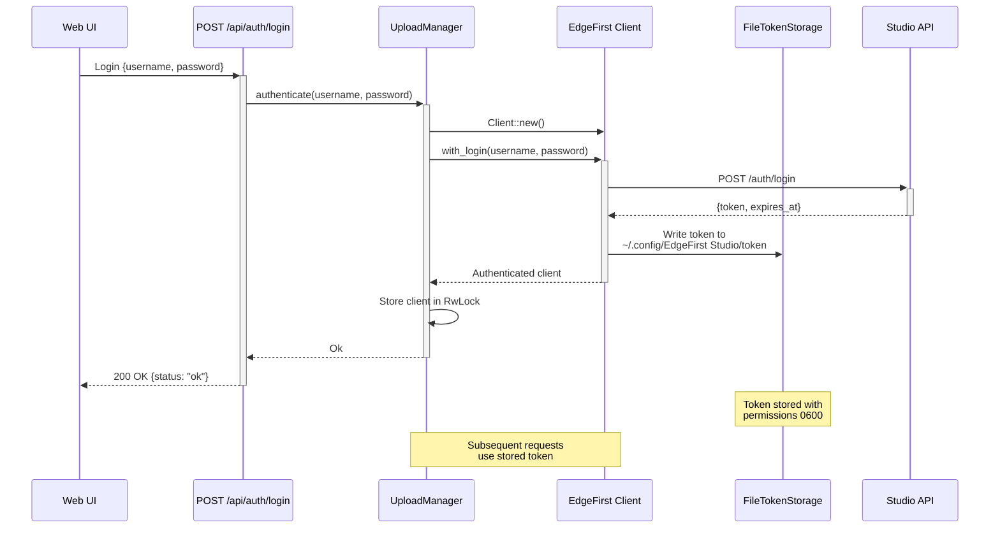
```mermaid
sequenceDiagram
    participant UI as Web UI
    participant API as POST /api/auth/login
    participant UMgr as UploadManager
    participant Client as EdgeFirst Client
    participant Storage as FileTokenStorage
    participant Studio as Studio API

    UI->>+API: Login {username, password}
    API->>+UMgr: authenticate(username, password)
    UMgr->>Client: Client::new()
    UMgr->>+Client: with_login(username, password)
    Client->>+Studio: POST /auth/login
    Studio-->>Client: {token, expires_at}
    deactivate Studio
    Client->>Storage: Write token to<br/>~/.config/EdgeFirst Studio/token
    Client-->>UMgr: Authenticated client
    deactivate Client
    UMgr->>UMgr: Store client in RwLock
    UMgr-->>API: Ok
    deactivate UMgr
    API-->>UI: 200 OK {status: "ok"}
    deactivate API

    Note over Storage: Token stored with<br/>permissions 0600

    Note over UMgr,Client: Subsequent requests<br/>use stored token
```

**Token Storage**:
- Default path: `~/.config/EdgeFirst Studio/token`
- File permissions: `0600` (owner read/write only)
- Automatic token refresh on expiration
- Single-user model (one Studio account per websrv instance)

### API Endpoints (Planned)

| Method | Endpoint | Handler | Purpose |
|--------|----------|---------|---------|
| POST | `/api/auth/login` | `auth_login` | Authenticate with Studio |
| GET | `/api/auth/status` | `auth_status` | Check authentication status |
| POST | `/api/uploads` | `start_upload` | Start new upload task |
| GET | `/api/uploads` | `list_uploads` | List all uploads (including completed/failed) |
| GET | `/api/uploads/{id}` | `get_upload` | Get specific upload details |
| DELETE | `/api/uploads/{id}` | `cancel_upload` | Cancel in-progress upload |
| WS | `/ws/uploads` | `upload_websocket_handler` | Real-time progress updates |

### State Transitions

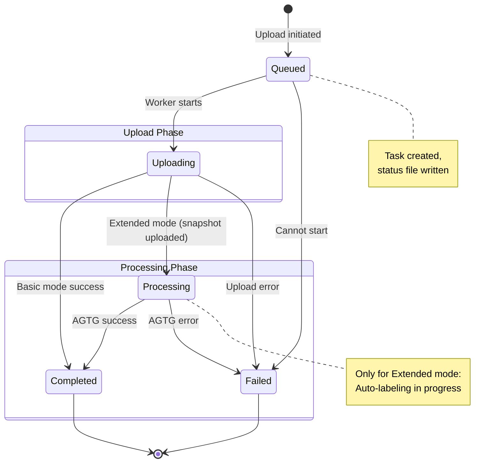
```mermaid
stateDiagram-v2
    [*] --> Queued: Upload initiated

    Queued --> Uploading: Worker starts
    Queued --> Failed: Cannot start

    state "Upload Phase" as Upload {
        Uploading --> Completed: Basic mode success
        Uploading --> Processing: Extended mode (snapshot uploaded)
        Uploading --> Failed: Upload error
    }

    state "Processing Phase" as Process {
        Processing --> Completed: AGTG success
        Processing --> Failed: AGTG error
    }

    Completed --> [*]
    Failed --> [*]

    note right of Queued
        Task created,
        status file written
    end note

    note right of Processing
        Only for Extended mode:
        Auto-labeling in progress
    end note
```

### Concurrency Model

- **Tokio async tasks** for background upload workers
- **Arc<RwLock<HashMap<UploadId, UploadTask>>>** for thread-safe task registry access
- **WebSocket broadcasting** via existing MessageStream infrastructure
- **Multiple concurrent uploads** supported (limited by system resources)

### Security Considerations

1. **Token Security**: FileTokenStorage uses restricted file permissions (0600)
2. **Path Validation**: MCAP paths validated to be within `storage_path`
3. **HTTPS Only**: All Studio communication over TLS
4. **No Credential Storage**: Username/password not persisted, only auth tokens
5. **Input Sanitization**: All API inputs validated before processing

### Integration with Existing Systems

- **MessageStream**: Reuses existing WebSocket broadcast infrastructure
- **ServerContext**: Upload manager added as `Arc<UploadManager>` field
- **Storage Path**: Uses same `args.storage_path` as MCAP recording
- **axum**: All endpoints follow existing handler patterns
- **Error Handling**: Consistent with existing `anyhow::Result<>` patterns

## Configuration Management

### Configuration Files

```mermaid
graph TB
    subgraph "System Mode Config"
        direction TB
        DefaultFiles[/etc/default/*]
        RecorderConf[/etc/default/recorder]
        UploaderConf[/etc/default/uploader]
        CustomConf[/etc/default/{service}]
    end

    subgraph "User Mode Config"
        direction TB
        CmdLine[Command-line Args]
        WebUIArgs[WebUI Settings Page]
    end

    subgraph "WebSrv Args"
        direction TB
        Docroot[--docroot]
        StoragePath[--storage-path]
        System[--system]
        ZenohMode[--mode peer]
        Topics[Zenoh topic mappings]
    end

    GetConf[GET /api/config/{service}] --> DefaultFiles
    SetConf[POST /api/config/{service}] --> DefaultFiles

    WebUIArgs --> CmdLine

    DefaultFiles -.-> RecorderConf
    DefaultFiles -.-> UploaderConf
    DefaultFiles -.-> CustomConf

    CmdLine --> Docroot
    CmdLine --> StoragePath
    CmdLine --> System
    CmdLine --> ZenohMode
    CmdLine --> Topics
```

#### Configuration Writes

`POST /api/config/{service}` edits the file named by the request body's
`fileName` field through `envfile::plan_edit`, a pure function that validates
every submitted key and returns the complete prospective file content.

`fileName` and the `{service}` URL segment must name the same file; a request
where they disagree is refused with 400 and nothing is written. The body
remains what selects the file, but the URL is no longer inert, so
authorization or audit logging keyed on the URL path (neither exists today)
cannot be bypassed by pointing the body at a different service.

Because planning touches no files, a rejected key leaves the file untouched by
construction.

Both `#` and `;` begin a comment, matching systemd's own `EnvironmentFile`
parser (`man systemd.exec`). A commented line with either prefix is a home for
the key it names: activating that setting inserts the new line directly below
it rather than appending a duplicate. `GET` omits commented lines entirely, so
posting back the map `GET` returned is always a valid request.

Each key resolves in this order:

1. An active `KEY=` line is rewritten in place. Every duplicate active line
   is rewritten too, because systemd takes the *last* definition and a stale
   duplicate would otherwise silently win.
2. Otherwise a new active line is inserted directly below the **last**
   `#KEY=` line, so the key lands in its documented section and the comment
   stays as a record of the shipped default.
3. Otherwise the key is appended under `# --- Added by edgefirst-websrv ---`
   and reported in `unmatched`. `unmatched` names only keys that landed here —
   a key set to `null` that is simply absent from the file is not in it.

When the resolved line already reads exactly what would be written, no line
changes and the key is reported `unchanged`: the file already expresses that
value.

A JSON `null` unsets a key by commenting it out. An empty string, in
contrast, is written literally: for some services empty is a meaningful value
that differs from absent. `fusion`'s `LIDAR_OUTPUT_TOPIC=""` disables that
output, while an absent key falls back to the non-empty default
`"fusion/lidar"` — treating the two the same would silently re-enable a
disabled output.

Values are escaped for `\` and `"`; newlines and other control characters
are rejected outright, since a newline would inject arbitrary lines into a
file systemd feeds to services running as root. The file is replaced
atomically, and the service is restarted only when the content actually
changed.

Keys naming a loader or language-runtime variable are refused whatever their
value: anything beginning `LD_`, plus `PATH`, `ENV`, `IFS`, `BASH_ENV`,
`SHELLOPTS`, `GLIBC_TUNABLES`, `PYTHONPATH`, `PYTHONHOME`, `PYTHONSTARTUP`,
`PERL5LIB` and `NODE_OPTIONS`. These are consumed before the service's own
code runs, so writing one converts a configuration edit into control of the
process. Most units run as root with no `User=` and a successful save
restarts the unit, which would make an appended `LD_PRELOAD=` line code
execution as root. The names appear in none of the shipped `.default` files,
so nothing legitimate is refused. This is a backstop, not a boundary — the
mutating routes are still unauthenticated, so a caller who can reach them can
rewrite genuine settings and restart the unit regardless.

##### Response

`set_config` always returns a JSON object, whatever the outcome. Fields are
omitted (rather than emitted `null` or empty) when they do not apply, so a
plain successful save stays compact:

| Field | Type | Present when | Meaning |
|-------|------|--------------|---------|
| `service` | string | always | The `fileName` from the request (empty if the body was malformed). |
| `path` | string | file resolved | Absolute path of the file that was read or written. |
| `applied` | bool | always | `true` only when the file was actually rewritten. |
| `restarted` | bool | always | `true` when the service was active and restarted successfully. |
| `dispositions` | object | 200 only | Per-key outcome: updated/inserted/appended/unset/unchanged. |
| `unmatched` | string array | 200 only | Keys appended because absent everywhere in the file. |
| `reserved` | string array | reserved key sent | Stripped keys naming the file, not a setting. |
| `rejected` | object | 400, invalid key | Reason: invalid_key/invalid_value/unsupported_type/forbidden_key. |
| `tried` | string array | 404 | Every candidate path examined. |
| `reason` | string | 200, nothing to write | `"no changes"`. |
| `restart_error` | string | applied, but the restart failed | Detail from `check_service_status`. |
| `error` | string | 400 / 404 / 500 | Human-readable description of the failure. |

A few fields need more than the table row allows:

- `dispositions` is authoritative only when `applied` is `true`. On a
  `reason: "no changes"` response it still reflects the plan that was
  computed, which happens to equal the outcome since nothing changed.
- `unmatched` names only keys that landed in `dispositions` as `appended` —
  keys absent everywhere in the file, active or commented. A key set to
  JSON `null` that is already absent from the file is *not* in it: nothing
  changed, so nothing was appended.
- `reserved` matches key names case-insensitively; today the only reserved
  key is `fileName`.
- `restart_error` is not a server error: the configuration write already
  succeeded before the restart was attempted.

Status codes:

- **200** — applied (a line changed and the file was rewritten), or a no-op
  (`reason: "no changes"`, nothing to write).
- **400** — the request body was not valid JSON, was not a JSON object,
  `fileName` was missing, not a string, failed the path-safety whitelist, or
  disagreed with the `{service}` URL segment, or one or more submitted keys
  were rejected (`rejected` is populated).
- **415** — the request carried no `Content-Type: application/json`.
- **404** — neither candidate path is a regular file: the service has no
  configuration file, or the name resolves to a directory or other
  non-regular file (`tried` is populated).
- **500** — the resolved configuration file could not be read, or the
  rewritten content could not be written back.

Every one of these answers in this response shape, including the 400 and 415
raised by the JSON extractor before the handler body runs.

Example success body:

```json
{
  "service": "camera",
  "path": "/etc/default/camera",
  "applied": true,
  "restarted": true,
  "dispositions": { "RUST_LOG": "updated", "BRAND_NEW_KEY": "appended" },
  "unmatched": ["BRAND_NEW_KEY"],
  "reserved": ["fileName"]
}
```

Example rejection body (400):

```json
{
  "service": "camera",
  "path": "/etc/default/camera",
  "applied": false,
  "restarted": false,
  "reserved": ["fileName"],
  "rejected": {
    "TARGET": { "invalid_value": "value contains control character U+000A" }
  }
}
```

Example not-found body (404):

```json
{
  "service": "websrv-test-absent",
  "applied": false,
  "restarted": false,
  "error": "no config file",
  "tried": [
    "/etc/default/websrv-test-absent",
    "/etc/default/edgefirst-websrv-test-absent"
  ]
}
```

### Args Structure

**Location**: `args.rs` - struct Args

| Argument | Type | Default | Purpose |
|----------|------|---------|---------|
| `--docroot` | String | `/usr/share/webui` | Static file root directory |
| `--system` | bool | false | Enable system mode (vs user mode) |
| `--mode` | WhatAmI | peer | Zenoh connection mode |
| `--connect` | Vec<String> | [] | Zenoh endpoints to connect to |
| `--listen` | Vec<String> | [] | Zenoh endpoints to listen on |
| `--no-multicast-scouting` | bool | false | Disable Zenoh multicast |
| `--h264` | String | `camera/h264` | Video stream topic |
| `--draw-box` | bool | true | Enable bounding box overlay |
| `--draw-labels` | bool | true | Enable label overlay |
| `--mirror` | bool | true | Mirror video horizontally |
| `--storage-path` | String | `.` | MCAP storage directory |
| `--config-dir` | PathBuf | `/etc/default` | Service configuration directory |

## Security Architecture

### TLS Certificate Management

The server requires HTTPS for browser features (WebGL, hardware video decoding). Certificates are loaded using a priority chain that balances flexibility with ease of use.

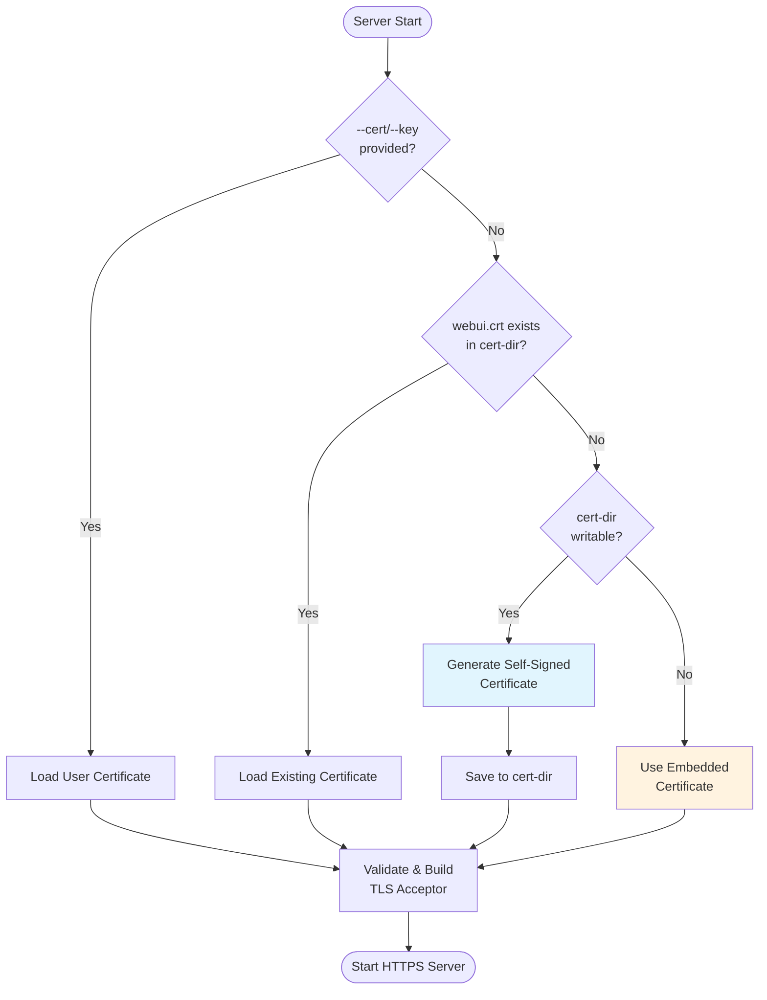
```mermaid
flowchart TD
    Start([Server Start]) --> CheckCLI{--cert/--key<br/>provided?}
    CheckCLI -->|Yes| LoadUser[Load User Certificate]
    CheckCLI -->|No| CheckDir{webui.crt exists<br/>in cert-dir?}
    CheckDir -->|Yes| LoadExisting[Load Existing Certificate]
    CheckDir -->|No| CheckWrite{cert-dir<br/>writable?}
    CheckWrite -->|Yes| Generate[Generate Self-Signed<br/>Certificate]
    CheckWrite -->|No| Fallback[Use Embedded<br/>Certificate]

    LoadUser --> Validate
    LoadExisting --> Validate
    Generate --> Save[Save to cert-dir]
    Save --> Validate
    Fallback --> Validate[Validate & Build<br/>TLS Acceptor]
    Validate --> StartTLS([Start HTTPS Server])

    style Generate fill:#e1f5fe
    style Fallback fill:#fff3e0
```

**Certificate Sources**:

| Priority | Source | Use Case |
|----------|--------|----------|
| 1 | `--cert`/`--key` CLI | Production with CA-signed certificates |
| 2 | `cert-dir/webui.crt` | Persistent device certificates |
| 3 | Auto-generated | First-run on new devices |
| 4 | Embedded fallback | Development/CI environments |

### Self-Signed Certificate Generation

Generated certificates include the device hostname for mDNS compatibility:

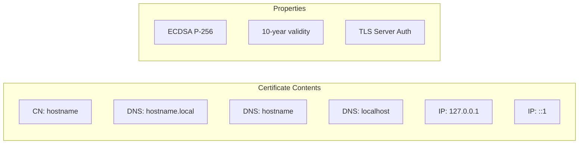
```mermaid
flowchart LR
    subgraph "Certificate Contents"
        CN[CN: hostname]
        SAN1[DNS: hostname.local]
        SAN2[DNS: hostname]
        SAN3[DNS: localhost]
        SAN4[IP: 127.0.0.1]
        SAN5[IP: ::1]
    end

    subgraph "Properties"
        Key[ECDSA P-256]
        Valid[10-year validity]
        Usage[TLS Server Auth]
    end
```

**File Locations**:
- Certificate: `{cert-dir}/webui.crt` (mode 0644)
- Private Key: `{cert-dir}/webui.key` (mode 0600)

### HTTPS Configuration

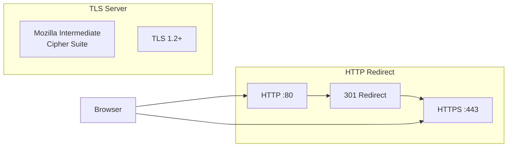
```mermaid
graph LR
    subgraph "HTTP Redirect"
        HTTP[HTTP :80] --> Redirect[301 Redirect]
        Redirect --> HTTPS
    end

    subgraph "TLS Server"
        HTTPS[HTTPS :443]
        Mozilla[Mozilla Intermediate<br/>Cipher Suite]
        TLS12[TLS 1.2+]
    end

    Browser --> HTTP
    Browser --> HTTPS
```

**TLS Implementation**:
- **Cipher Suites**: rustls defaults (modern TLS 1.2+ and TLS 1.3)
- **Protocol**: TLS 1.2+ via rustls `ServerConfig`
- **HTTP**: Always redirects to HTTPS via axum redirect handler

### Path Validation

**MCAP Download** (`mcap_downloader`):
1. Extract filename from URL path parameter
2. Validate `.mcap` extension (case-insensitive)
3. Verify file exists and is a regular file
4. Reject if checks fail (403 Forbidden or 404 Not Found)

**File Deletion** (`delete`):
1. Construct full path from directory + filename
2. Validate path components (no directory traversal)
3. Verify file exists before deletion
4. Execute deletion only after all validations pass

**Configuration Access**:
- System mode: Restrict to `/etc/default/` directory
- User mode: Return in-memory WebUISettings (no filesystem access)

## Deployment Modes

### System Mode vs User Mode

```mermaid
graph TB
    subgraph "System Mode (--system)"
        direction TB
        SystemD_Mgmt[systemd Service Management]
        SystemD_Services[recorder.service<br/>replay.service<br/>Custom services]
        SystemConf[/etc/default/* configs]
        RootPerms[Requires sudo/root]

        SystemD_Mgmt --> SystemD_Services
        SystemD_Mgmt --> SystemConf
        SystemD_Services --> RootPerms
    end

    subgraph "User Mode (default)"
        direction TB
        Direct_Spawn[Direct Process Spawning]
        UserProcesses[maivin-recorder<br/>User-owned processes]
        CmdLineConf[Command-line arguments]
        UserPerms[Standard user permissions]

        Direct_Spawn --> UserProcesses
        Direct_Spawn --> CmdLineConf
        UserProcesses --> UserPerms
    end

    Args[Args::parse] --> |--system=true| SystemD_Mgmt
    Args --> |--system=false| Direct_Spawn
```

**System Mode** (`--system`):
- **Use Case**: Production deployments, system-wide services
- **Service Control**: Via `systemctl start/stop/enable/disable`
- **Configuration**: Files in `/etc/default/`
- **Recording**: `recorder.service` managed by systemd
- **Playback**: `replay.service` managed by systemd
- **Permissions**: Requires sudo for service operations
- **Routes**: Uses system-specific handlers (`start`, `stop`, `get_config`)

**User Mode** (default):
- **Use Case**: Development, single-user installations
- **Service Control**: Direct process spawning with `Command::new()`
- **Configuration**: Command-line arguments + WebUI settings
- **Recording**: `maivin-recorder` process in `AppState.process`
- **Playback**: `replay.service` (still uses systemd, may require user service)
- **Permissions**: Runs as current user
- **Routes**: Uses user-specific handlers (`user_mode_start`, `user_mode_stop`, `user_mode_get_config`)

**Handler Differences**:

| Function | System Mode | User Mode |
|----------|-------------|-----------|
| Start recording | `start()` → systemctl | `user_mode_start()` → spawn process |
| Stop recording | `stop()` → systemctl | `user_mode_stop()` → kill process |
| Check recorder | `check_recorder_status()` → systemctl | `user_mode_check_recorder_status()` → parse systemctl |
| Get config | `get_config()` → /etc/default | `user_mode_get_config()` → WebUISettings |
| Check replay | `check_replay_status()` → systemctl | `user_mode_check_replay_status()` → PID file |

## Data Flow Examples

### Real-Time Video Streaming

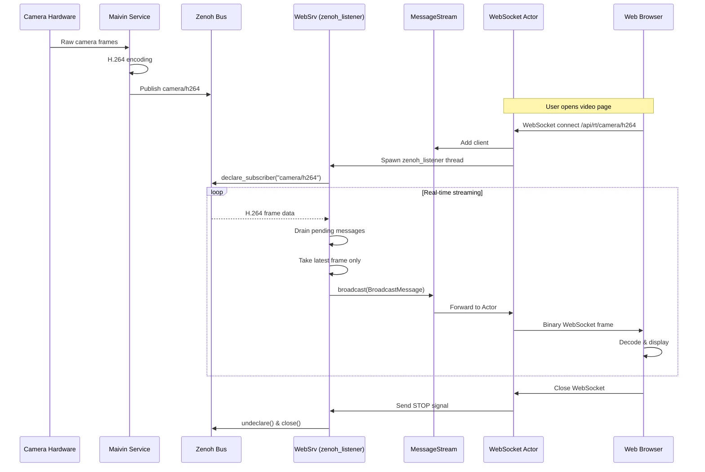
```mermaid
sequenceDiagram
    participant Camera as Camera Hardware
    participant Maivin as Maivin Service
    participant Zenoh as Zenoh Bus
    participant WebSrv as WebSrv (zenoh_listener)
    participant Stream as MessageStream
    participant WS as WebSocket Actor
    participant Browser as Web Browser

    Camera->>Maivin: Raw camera frames
    Maivin->>Maivin: H.264 encoding
    Maivin->>Zenoh: Publish camera/h264

    Note over Browser,WS: User opens video page
    Browser->>WS: WebSocket connect /api/rt/camera/h264
    WS->>Stream: Add client
    WS->>WebSrv: Spawn zenoh_listener thread

    WebSrv->>Zenoh: declare_subscriber("camera/h264")

    loop Real-time streaming
        Zenoh-->>WebSrv: H.264 frame data
        WebSrv->>WebSrv: Drain pending messages
        WebSrv->>WebSrv: Take latest frame only
        WebSrv->>Stream: broadcast(BroadcastMessage)
        Stream->>WS: Forward to Actor
        WS->>Browser: Binary WebSocket frame
        Browser->>Browser: Decode & display
    end

    Browser->>WS: Close WebSocket
    WS->>WebSrv: Send STOP signal
    WebSrv->>Zenoh: undeclare() & close()
```

### MCAP Recording to Upload

```mermaid
sequenceDiagram
    participant UI as Web UI
    participant API as WebSrv API
    participant Recorder as recorder.service
    participant Storage as MCAP Storage
    participant UMgr as UploadManager
    participant Studio as EdgeFirst Studio

    Note over UI,Recorder: Recording Phase
    UI->>+API: POST /start
    API->>Recorder: systemctl start recorder
    Recorder->>Storage: Write frames to recording.mcap
    API-->>UI: 200 OK

    Note over UI: User monitors recording

    UI->>+API: POST /stop
    API->>Recorder: systemctl stop recorder
    Recorder->>Storage: Finalize recording.mcap
    API-->>UI: 200 OK
    deactivate API

    Note over UI,Studio: Upload Phase

    UI->>+API: POST /api/auth/login
    API->>UMgr: authenticate(username, password)
    UMgr->>Studio: Login
    UMgr-->>API: Token stored
    API-->>UI: 200 OK
    deactivate API

    UI->>+API: POST /api/uploads<br/>{mcap_path, mode: Extended}
    API->>UMgr: start_upload(path, mode)
    UMgr->>Storage: Read recording.mcap
    UMgr->>Storage: Write .upload-status.json
    UMgr->>UMgr: Spawn background worker
    UMgr-->>API: upload_id
    API-->>UI: 202 Accepted {upload_id}
    deactivate API

    Note over UMgr,Studio: Background Upload + Auto-label

    UMgr->>+Studio: create_snapshot(recording.mcap)
    Studio-->>UMgr: snapshot_id
    deactivate Studio

    UMgr->>+Studio: restore_snapshot(project_id, snapshot_id, labels, autolabel)
    Studio->>Studio: AGTG auto-labeling
    Studio-->>UMgr: dataset_id
    deactivate Studio

    UMgr->>Storage: Update .upload-status.json (completed)
    UMgr->>UI: WebSocket: {state: completed, snapshot_id, dataset_id}
```

## Performance Considerations

### Optimization Strategies

**Static File Serving**:
- tower-http `ServeDir` with automatic `.html` extension resolution
- Browser caching via HTTP cache headers

**WebSocket Efficiency**:
- Binary frames via yawc with permessage-deflate compression
- tokio::sync::broadcast channels for fan-out to subscribers
- Per-client send timeouts and ping/pong keepalive
- Backpressure handling via `RecvError::Lagged` on receiver side

**Concurrency**:
- 8-worker Tokio runtime (`worker_threads = 8`)
- Multi-threaded HTTP server (axum with hyper)
- Arc-based shared state with broadcast channels
- Async tokio tasks for Zenoh listeners

**MCAP Handling**:
- Memory-mapped file access for zero-copy reads
- Streaming downloads (64KB chunks) to avoid buffering
- Asynchronous file operations via `tokio::fs`

**Connection Pooling**:
- WebSocket connection reuse for persistent streams
- Zenoh session pooling (one session per subscriber thread)

### Resource Usage

**Memory**:
- WebSocket mailboxes: 1-16 messages × frame size
- MCAP memory maps: Shared read-only mapping (minimal overhead)
- Upload task registry: HashMap with task metadata only (not MCAP contents)

**Network**:
- HTTPS: TLS overhead (10-15% vs plain HTTP)
- WebSocket: Binary frames with minimal protocol overhead
- Zenoh: UDP-based with built-in compression

**Disk I/O**:
- Sequential writes during recording (optimal for SSDs and HDDs)
- Memory-mapped reads for MCAP analysis (kernel page cache)
- Asynchronous file operations to avoid blocking Tokio workers

## System Integration Guide

This section is intended for system integrators and package maintainers who deploy
websrv on production devices. The websrv binary itself is portable and requires no
special handling — all deployment-specific behavior is controlled through CLI
arguments, environment variables, and systemd unit configuration.

### Operating Modes

Websrv has two modes that determine how it manages recordings, configuration, and
service control.

#### System Mode (`--system`)

Intended for production deployments where EdgeFirst services are managed by systemd.

- **Service control**: Uses `systemctl start/stop/enable/disable` for recorder,
  replay, and other EdgeFirst services
- **Configuration**: Reads and writes `/etc/default/{service}` files (recorder,
  uploader, camera, model, etc.)
- **Storage path**: Read from `/etc/default/recorder` (`STORAGE_DIR` variable),
  with fallback to `--storage-path`
- **WebUI config endpoint**: `GET /api/config/{service}` returns the raw
  key-value content of `/etc/default/{service}`

#### User Mode (default)

Intended for development, testing, or single-user installations.

- **Service control**: Spawns `maivin-recorder` directly as a child process;
  tracks it via `Mutex<Option<Child>>`
- **Configuration**: All settings come from command-line arguments
- **Storage path**: Uses `--storage-path` (defaults to `.`)
- **WebUI config endpoint**: `GET /api/config/{service}` returns the CLI
  arguments as JSON (`WebUISettings`)

#### Handler Routing by Mode

| Function | System Mode | User Mode |
|----------|-------------|-----------|
| Start recording | `systemctl start recorder` | `Command::new("maivin-recorder")` |
| Stop recording | `systemctl stop recorder` | Kill child process |
| Recorder status | `systemctl is-active recorder` | Check child process alive |
| Replay status | `systemctl is-active replay` | Check PID file |
| Get config | Read `/etc/default/{service}` | Return `WebUISettings` JSON |
| Set config | Write `/etc/default/{service}` | Write `/etc/default/{service}` |

### Systemd Socket Activation

Websrv supports systemd socket activation via the `listenfd` crate. This allows
the server to bind privileged ports (80/443) without running as root — systemd
binds the sockets and passes pre-bound file descriptors to the service process.

**Detection is automatic**: when the `LISTEN_FDS` environment variable is present
(set by systemd), websrv accepts the passed file descriptors. When absent, it
binds ports directly using `--http-port` and `--https-port`. No CLI flag is needed.

#### File Descriptor Assignment

| FD Index | Purpose | Fallback |
|----------|---------|----------|
| 0 | HTTP listener (redirect to HTTPS) | Bind `[::]:{http_port}` |
| 1 | HTTPS listener (main server) | Bind `[::]:{https_port}` |

#### Example Socket Unit (`websrv.socket`)

```ini
[Unit]
Description=EdgeFirst WebSrv Sockets

[Socket]
ListenStream=80
ListenStream=443
BindIPv6Only=both

[Install]
WantedBy=sockets.target
```

#### Example Service Override

```ini
# /etc/systemd/system/websrv.service.d/override.conf
[Service]
ExecStart=
ExecStart=/usr/bin/edgefirst-websrv --system
User=torizon
```

#### Important Notes

- When socket activation is active, `--http-port` and `--https-port` are ignored
  (systemd controls which ports are bound)
- Stopping the service alone (`systemctl stop websrv.service`) does not close the
  listening sockets — systemd will re-spawn the service on the next incoming
  connection. To fully stop, also stop the socket unit:
  `systemctl stop websrv.socket websrv.service`
- The `set_nonblocking(true)` call is made automatically on activated listeners
  before converting them to async Tokio listeners

### TLS Certificate Management

The server requires HTTPS for browser security features (WebSocket upgrade, WebGL,
hardware video decoding). Certificates are resolved using a priority chain:

| Priority | Source | CLI / Env | Use Case |
|----------|--------|-----------|----------|
| 1 | Explicit cert/key files | `--cert` + `--key` | CA-signed production certs |
| 2 | Existing files in cert-dir | `--cert-dir` / `CERT_DIR` | Persistent device certs |
| 3 | Auto-generated self-signed | (saved to cert-dir) | First-run on new devices |
| 4 | In-memory self-signed | (not persisted) | cert-dir not writable |

**Default cert-dir**: `/etc/edgefirst/ssl` (regardless of user). Override with
`--cert-dir` or the `CERT_DIR` environment variable.

**File names**: `webui.crt` (mode 0644) and `webui.key` (mode 0600).

**Force regeneration**: `--generate-cert` skips loading existing certs and
generates a new self-signed certificate.

**When running as a non-root user**: The default `/etc/edgefirst/ssl` is typically
not writable. The system integrator should either:
- Create the directory with appropriate ownership/permissions before first run
- Set `CERT_DIR` in the service unit to a user-writable path (e.g.,
  `/home/torizon/.config/edgefirst/ssl`)
- Provide explicit cert/key paths via `--cert` and `--key`

If none of these are done, the server still starts — it generates an in-memory
certificate on each startup, but the certificate won't persist across restarts
(browsers will see a new certificate fingerprint each time).

### Configuration Files (`/etc/default/*`)

In system mode, websrv reads and writes service configuration files under
`/etc/default/`. These are standard shell-style `KEY=VALUE` files.

| File | Used By | Key Variables |
|------|---------|---------------|
| `recorder` | Recording control | `STORAGE_DIR`, `CAMERA_TOPIC`, `TAG` |
| `uploader` | Studio uploads | `URL`, `JWT`, `TOPIC` |
| `camera` | Camera service | `JPEG`, `H264_TOPIC`, etc. |
| `model` | Inference service | `MODEL`, `MASK_COMPRESSION`, etc. |
| `{service}` | Any EdgeFirst service | Service-specific variables |

**Dual naming convention**: Config files can use either the generic
`edgefirst-{service}` name or the short `{service}` name. The websrv
resolver tries the requested name first, then falls back to the alternate:

- Looking up `recorder` → tries `/etc/default/recorder`, then
  `/etc/default/edgefirst-recorder`
- Looking up `edgefirst-recorder` → tries `/etc/default/edgefirst-recorder`,
  then `/etc/default/recorder`

This supports two packaging conventions:

| Convention | Config files | Service units | Used by |
|------------|-------------|---------------|---------|
| **Generic** (`edgefirst-` prefix) | `/etc/default/edgefirst-recorder` | `edgefirst-recorder.service` | Default packaging |
| **Platform** (short name) | `/etc/default/recorder` | `recorder.service` | Maivin (symlinks) |

On Maivin, binaries are still named `edgefirst-{service}` but the packaging
includes symlinks for the short names, and config/service files use the
unprefixed names since EdgeFirst services are the primary ones on the device.

**Permission requirements**: The websrv process must have read/write access to
these files. When running as root this is automatic. When running as a non-root
user, the system integrator should ensure the files are writable — typically via
a shared group (e.g., `edgefirst`) with group-write permissions.

### Port Configuration

| Argument | Env Var | Default | Notes |
|----------|---------|---------|-------|
| `--http-port` | `HTTP_PORT` | 80 | HTTP → HTTPS redirect only |
| `--https-port` | `HTTPS_PORT` | 443 | Main HTTPS server |

These are ignored when systemd socket activation is active.

For non-root operation without socket activation, use unprivileged ports:

```bash
edgefirst-websrv --http-port 8080 --https-port 8443
```

### WebSocket Compression

Permessage-deflate compression is enabled by default on all WebSocket connections.
Pre-compressed topics (H.264 video, JPEG images) are automatically detected by
the server and served without compression — deflating already-compressed data
wastes CPU without reducing payload size.

Auto-detection is based on the topic name containing `h264` or `jpeg`. Clients
can also explicitly disable compression with the `?compress=false` query parameter.

### Deployment Checklist

For a system integrator deploying websrv on a new platform:

1. **Choose the operating user**: root (simplest) or a specific user (more secure)
2. **If non-root with privileged ports**: Create a `websrv.socket` unit and service
   override with `User=`
3. **Certificate directory**: Either create `/etc/edgefirst/ssl` owned by the
   service user, or set `CERT_DIR` to a writable path
4. **Configuration files**: Ensure `/etc/default/*` files are readable/writable by
   the service user (shared group recommended)
5. **Storage path**: When running as a non-root user, `$HOME` resolves to that
   user's home directory — `STORAGE_DIR` in `/etc/default/recorder` should use an
   absolute path or `$HOME` expansion
6. **WebUI docroot**: Set `--docroot` or `DOCROOT` to the installed location of
   the webui files (default: `/usr/share/edgefirst/webui`)
7. **Studio tokens**: The `edgefirst-client` library stores login tokens under
   `~/.config/EdgeFirst Studio/token` — the service user must match the user who
   logged in, or tokens won't be found

## Future Enhancements

### Planned Features

1. **Multi-user Support**
   - Per-user authentication tokens
   - Role-based access control (RBAC)
   - User-specific upload queues

2. **Advanced Upload Management**
   - Automatic retry on network failures
   - Bandwidth throttling for background uploads
   - Upload queue prioritization

3. **Enhanced Monitoring**
   - System metrics dashboard (CPU, memory, disk I/O)
   - Real-time Zenoh topic monitoring
   - Upload progress aggregation (total bytes, ETA)

4. **Studio Integration Enhancements**
   - Batch snapshot uploads
   - Snapshot metadata editing
   - Direct dataset browsing from WebUI

5. **Configuration**
   - Web-based configuration editor
   - Configuration version control
   - Configuration import/export

6. **Custom Dashboards**
   - User-defined layouts
   - Widget library (charts, gauges, video players)
   - Saved dashboard templates

7. **Remote Deployment Management**
   - Fleet management for multiple devices
   - Remote configuration updates
   - Centralized logging and monitoring

### Technical Debt

- Replace embedded certificate with proper PKI
- Add API versioning (`/api/v1/...`)
- Implement structured logging (JSON format)
- Add comprehensive error type hierarchy (replace `anyhow`)
- Implement request tracing (distributed tracing support)
- Add unit and integration test coverage
- Performance benchmarking suite
- API documentation (OpenAPI/Swagger)

## References

### Key Source Files

| File | Primary Responsibilities |
|------|-------------------------|
| `src/main.rs` | HTTP server, WebSocket handlers, API endpoints, Upload Manager |
| `src/args.rs` | Command-line argument parsing, configuration conversion |

### External Dependencies

| Crate | Version | Purpose |
|-------|---------|---------|
| `axum` | 0.8 | HTTP server framework |
| `axum-server` | 0.7 | TLS server with rustls |
| `yawc` | 0.3 | WebSocket with permessage-deflate |
| `rustls` | 0.23 | TLS implementation |
| `tower-http` | 0.6 | Static file serving middleware |
| `zenoh` | 1.6.2 | Real-time data bus |
| `mcap` | 0.23.4 | MCAP file format parsing |
| `edgefirst-client` | 2.6.4 | EdgeFirst Studio API client |
| `tokio` | 1.48.0 | Async runtime |
| `listenfd` | 1 | systemd socket activation |
| `serde_json` | 1.0 | JSON serialization |
| `uuid` | 1.18 | Unique identifiers |
| `chrono` | 0.4 | Date/time handling |

### Related Documentation

- **axum**: https://docs.rs/axum/latest/axum/
- **yawc**: https://docs.rs/yawc/latest/yawc/
- **rustls**: https://docs.rs/rustls/latest/rustls/
- **Zenoh**: https://zenoh.io/docs/
- **MCAP Format**: https://mcap.dev/
- **EdgeFirst Studio API**: Internal documentation
- **Tokio Runtime**: https://tokio.rs/tokio/tutorial

---

**Document Version**: 2.0
**Last Updated**: 2026-03-10
**Author**: Sébastien Taylor <sebastien@au-zone.com>
